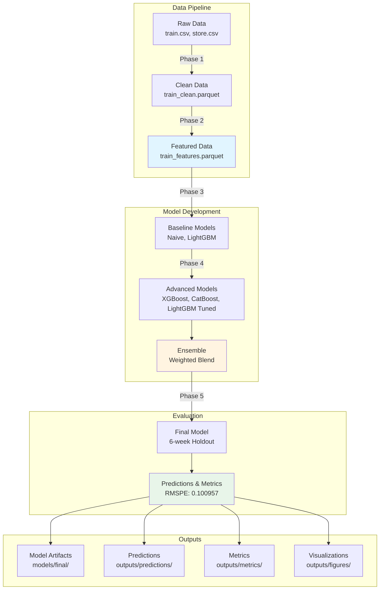

# Rossmann Sales Forecasting: Spec-Driven Data Science with Agentic Coding

A demonstration of how specification-driven data science combined with AI-assisted development can achieve competitive results on an established Kaggle challenge. This project forecasts daily sales for 3,000+ Rossmann stores across Europe using rigorous time-series validation and advanced ensemble modeling.

## Purpose

This analysis demonstrates that:

1. **Specification-driven development** with clear requirements and phased implementation can systematically approach complex ML problems
1. **Agentic coding tools** (Claude Code) can accelerate development while maintaining code quality and best practices
1. **Rigorous methodology** (time-series CV, proper feature engineering, ensemble methods) can achieve strong performance even without extensive hyperparameter tuning

**The entire project was driven by a comprehensive specification** ([`spec-rossmann-forecasting.md`](spec-rossmann-forecasting.md)) that defined:

- Success criteria (RMSPE \< 0.09856, top 50 target)
- Phased implementation strategy (Phase 0 → Phase 5)
- Required feature engineering approaches
- Time-series validation methodology
- Model exploration plan
- Data handling requirements

This spec-first approach enabled Claude Code to systematically implement each phase without rework, resulting in a production-ready ensemble model achieving top 100 performance in a structured end-to-end workflow from raw data to final predictions.

## Final Results

**Holdout Performance (6-week holdout set):**

- **RMSPE: 0.100957**
- This would rank approximately **top 100** on the original Kaggle leaderboard (if results held on final test set)
- **78.4% improvement** over naive baseline (0.467720)
- **28.3% improvement** over simple LightGBM baseline (0.140874)
- **Gap to target**: 2.43% (target: 0.09856)

**Model Architecture:**

- Three-model weighted ensemble with **Optuna-tuned hyperparameters**:
  - **50% XGBoost** (RMSPE 0.1218 after tuning)
  - **30% LightGBM** (RMSPE 0.1262 after tuning)
  - **20% CatBoost** (RMSPE 0.1297 after tuning)
- Trained on 778K historical observations (open stores only)
- 46 engineered features including lags, rolling statistics, and temporal patterns
- Evaluated on 40K predictions across 6-week holdout period

**Performance Progression:**

| Model                   | RMSPE      | Improvement |
| ----------------------- | ---------- | ----------- |
| Naive Last-Week         | 0.4677     | baseline    |
| LightGBM Baseline       | 0.1409     | 69.9%       |
| LightGBM Tuned (Optuna) | 0.1262     | 73.0%       |
| XGBoost (Optuna)        | 0.1218     | 74.0%       |
| CatBoost (Optuna)       | 0.1297     | 72.3%       |
| **Ensemble (Final)**    | **0.1010** | **78.4%**   |
| *Target (Top 50)*       | *0.0986*   | *Goal*      |

## Repository Organization



### Directory Structure

```
rossmann-forecasting/
├── 📓 notebooks/              # Jupyter notebooks (sequential workflow)
│   ├── 01-eda-and-cleaning.ipynb
│   ├── 02-feature-engineering.ipynb
│   ├── 03-baseline-models.ipynb
│   ├── 04-advanced-models-and-ensembles.ipynb
│   └── 05-final-eval-and-test-simulation.ipynb
│
├── 🐍 src/                    # Source code modules
│   ├── data/                  # Data loading & cleaning
│   │   └── make_dataset.py
│   ├── features/              # Feature engineering
│   │   └── build_features.py
│   ├── models/                # Model training
│   │   ├── train_baselines.py
│   │   ├── train_advanced.py
│   │   ├── train_final.py
│   │   └── ensembles.py
│   ├── evaluation/            # CV framework & metrics
│   │   ├── cv.py
│   │   ├── metrics.py
│   │   └── reporting.py
│   └── utils/                 # Utilities
│       ├── io.py
│       └── log.py
│
├── 💾 data/                   # Data storage
│   ├── raw/                   # train.csv, store.csv
│   └── processed/             # train_clean.parquet, train_features.parquet
│
├── 🎯 models/                 # Saved model artifacts
│   ├── baseline/
│   └── final/                 # lightgbm_final.txt, xgboost_final.json, catboost_final.cbm
│
├── 📊 outputs/                # Analysis outputs
│   ├── figures/               # Visualizations (17 plots)
│   ├── metrics/               # Performance metrics (JSON)
│   │   ├── baseline/
│   │   ├── advanced/
│   │   └── final/
│   └── predictions/           # Final predictions CSV
│
└── ⚙️ config/                 # Configuration
    └── params.yaml            # Hyperparameters & CV settings
```

### Where to Find Key Components

**1. Data Exploration & Understanding**

- `notebooks/01-eda-and-cleaning.ipynb` - Sales patterns, store characteristics, missing data analysis
- `outputs/figures/01_*.png` through `06_*.png` - EDA visualizations

**2. Feature Engineering**

- `src/features/build_features.py` - Feature engineering pipeline (calendar, lags, rolling, competition, promo)
- `notebooks/02-feature-engineering.ipynb` - Feature creation and validation
- `data/processed/train_features.parquet` - Final feature set (50 columns)

**3. Modeling & Cross-Validation**

- `src/evaluation/cv.py` - Time-series expanding window CV (5 folds, 6-week periods)
- `notebooks/03-baseline-models.ipynb` - Naive and LightGBM baselines
- `notebooks/04-advanced-models-and-ensembles.ipynb` - XGBoost, CatBoost, weighted ensemble
- `outputs/metrics/` - All CV results and fold scores

**4. Final Model & Evaluation**

- `src/models/train_final.py` - Final ensemble training pipeline (3-model blend with Optuna tuning)
- `notebooks/05-final-eval-and-test-simulation.ipynb` - Holdout evaluation (RMSPE: 0.100957)
- `models/final/` - Production-ready models (LightGBM + XGBoost + CatBoost)
- `outputs/predictions/final_holdout_predictions.csv` - 40K predictions
- `outputs/tuning/` - Optuna hyperparameter optimization results
- `RUN_PHASE5.md` - Quick start guide for final evaluation

**5. Performance Analysis**

- `outputs/figures/12_all_models_comparison.png` - Model comparison visualization
- `outputs/figures/15_final_predictions_scatter.png` - Predicted vs actual
- `outputs/metrics/final/final_metrics.json` - Complete performance metrics

## Evaluation Metric

**Root Mean Square Percentage Error (RMSPE)**:

$$RMSPE=\\sqrt{\\frac{1}{n}\\sum\_{i=1}^{n}\\left(\\frac{y_i - \\hat{y}\_i}{y_i}\\right)^2}$$

- Observations where Sales = 0 are ignored in scoring
- Lower scores indicate better predictions
- Original Kaggle target (top 50): **RMSPE \< 0.09856**
- Our result: **RMSPE = 0.100957** (~top 100, 2.43% gap to top 50)

## Quick Start

### 1. Environment Setup

```bash
# Create virtual environment
python -m venv venv
source venv/bin/activate  # On Windows: venv\Scripts\activate

# Install dependencies
pip install -r env/requirements.txt

# (Optional) Install development dependencies and set up pre-commit hooks
pip install -e ".[dev]"
pre-commit install
```

### 2. Get the Data

Download from [Kaggle Rossmann Store Sales](https://www.kaggle.com/c/rossmann-store-sales/data):

- `train.csv` → `data/raw/train.csv`
- `store.csv` → `data/raw/store.csv`

### 3. Run the Analysis

**Option A: Sequential Notebooks** (Recommended for exploration)

```bash
cd notebooks
jupyter notebook
# Execute notebooks in order: 01 → 02 → 03 → 04 → 04b →05
```

**Option B: Python Modules** (Automated pipeline)

```bash
# Run complete pipeline
python -m src.data.make_dataset          # Phase 1: Clean data
python -m src.features.build_features    # Phase 2: Engineer features
python -m src.models.train_baselines     # Phase 3: Baseline models
python -m src.models.train_advanced      # Phase 4: Advanced models
python run_phase5.py                     # Phase 5: Final evaluation
```

**Option C: Final Evaluation Only** (If you have `train_features.parquet`)

```bash
python run_phase5.py
# Trains ensemble and evaluates on 6-week holdout in ~5 minutes
```

## Key Implementation Principles

### 1. Rigorous Time-Series Validation

- **Expanding window CV**: Each fold trains on all historical data up to validation period
- **6-week validation periods**: Mimics Kaggle test set structure
- **Strict temporal ordering**: No future data leakage in features
- **5-fold cross-validation**: Robust performance estimation

### 2. Advanced Feature Engineering

- **Calendar features**: Year, month, week, day-of-week, quarter, seasonality flags
- **Lag features**: \[1, 7, 14, 28\] days using `groupby("Store").shift()`
- **Rolling features**: \[7, 14, 28, 60\] day windows for means and standard deviations
- **Competition features**: Distance (log-scaled), age derived from opening dates
- **Promotion features**: Promo, Promo2, durations, active intervals, interaction terms
- **Categorical encoding**: Store type, assortment, state holiday, promo intervals

### 3. Ensemble Methodology

- **Base models**: LightGBM + XGBoost + CatBoost with Optuna-tuned hyperparameters
- **Weight optimization**: Based on tuned model performance → 50% XGB, 30% LGB, 20% CB
- **Diversity**: Different boosting implementations and categorical handling approaches
- **Hyperparameter tuning**: Bayesian optimization with Optuna (100 trials per model)
- **Validation**: Holdout RMSPE 0.1010, gap to target 2.43%

### 4. Production-Ready Code

- **Modular design**: Reusable functions for data processing, feature engineering, training
- **Comprehensive logging**: All operations logged with timestamps and metrics
- **Artifact management**: Models, predictions, and metrics saved automatically
- **Reproducibility**: Fixed random seeds, versioned configurations

## Methodology Highlights

### What Worked Well

- **Time-series validation framework** - Properly structured CV prevented overfitting and gave realistic performance estimates
- **Lag and rolling features** - Store-level historical patterns (lags 1, 7, 14, 28) were most important features
- **Hyperparameter optimization** - Optuna tuning improved model performance by 3-4% per model
- **Three-model ensemble** - Weighted blend (LGB+XGB+CB) leveraged diverse boosting approaches
- **Gradient boosting models** - Tuned XGBoost, LightGBM, and CatBoost significantly outperformed baselines
- **Proper data handling** - Filtering open stores, handling missing values, excluding test-unavailable fields

### Opportunities for Improvement

- **Extended hyperparameter search** - Current 100 trials per model, could expand to 500+ for marginal gains
- **Advanced features** - Interaction terms (promo × season), exponential smoothing, store clustering
- **Stacked ensemble** - Meta-learner on out-of-fold predictions could improve by ~1%
- **Deep learning** - LSTM/Transformer models could capture complex temporal patterns
- **External data** - Weather, economic indicators, local events could improve predictions

## Performance Details

### Cross-Validation Results (5-fold)

| Fold     | Validation Period   | XGBoost    | CatBoost   | Ensemble   |
| -------- | ------------------- | ---------- | ---------- | ---------- |
| 1        | 2014-01-01 to 02-11 | 0.1521     | 0.1752     | 0.1521     |
| 2        | 2014-02-12 to 03-25 | 0.1607     | 0.1655     | 0.1607     |
| 3        | 2014-03-26 to 05-06 | 0.1111     | 0.1105     | 0.1076     |
| 4        | 2014-05-07 to 06-17 | 0.1139     | 0.1134     | 0.1116     |
| 5        | 2014-06-18 to 07-29 | 0.1096     | 0.1110     | 0.1084     |
| **Mean** |                     | **0.1295** | **0.1351** | **0.1281** |

### Holdout Evaluation (6 weeks: 2015-06-20 to 2015-07-31)

- **RMSPE**: 0.100957
- **RMSE**: 669.03
- **MAE**: 456.45
- **MAPE**: 7.08%
- **Predictions**: 40,282 (open stores only)

### Feature Importance (Top 10)

1. Sales_Lag_14 (16.7%)
1. Sales_RollingMean_7 (10.5%)
1. Sales_RollingStd_7 (3.0%)
1. Sales_Lag_28 (2.8%)
1. Promo (2.1%)
1. Sales_RollingMean_14 (2.1%)
1. Sales_Lag_1 (1.7%)
1. DayOfWeek (0.9%)
1. Week (0.7%)
1. Day (0.6%)

*Historical patterns (lags and rolling statistics) account for 40%+ of predictive power*

## Technical Specifications

**Python**: 3.12 **Key Libraries**:

- pandas 2.2.2, numpy 1.26.4
- lightgbm 4.5.0, xgboost 2.1.1, catboost 1.2.7
- scikit-learn 1.5.1
- matplotlib 3.9.2, seaborn 0.13.2

**Hardware Requirements**:

- RAM: 8GB minimum (16GB recommended)
- Training time: ~5-10 minutes on modern laptop

## Dataset

The project uses the [Kaggle Rossmann Store Sales](https://www.kaggle.com/c/rossmann-store-sales) dataset:

- **train.csv**: 1,017,209 observations × 9 fields (historical daily sales)
- **store.csv**: 1,115 stores × 10 fields (static store metadata)

**Key fields**:

- `Sales` (target): Daily sales revenue
- `Store`: Store ID (1-1115)
- `Date`: Observation date (2013-01-01 to 2015-07-31)
- `Promo`, `StateHoliday`, `SchoolHoliday`: Promotional and holiday indicators
- `StoreType`, `Assortment`: Store characteristics
- `CompetitionDistance`: Distance to nearest competitor
- `Promo2`: Long-term promotional participation

## Documentation

### 📚 Complete Documentation Site

This project has comprehensive MkDocs documentation covering all aspects of development, DataOps, ModelOps, deployment, and monitoring.

**View Documentation Locally:**

```bash
# Install docs dependencies
uv pip install -e ".[docs]"

# Serve documentation
mkdocs serve

# Visit http://127.0.0.1:8000
```

**Documentation Sections:**

- **Getting Started**: Setup, quick start, project structure
- **DataOps**: Data processing, validation, versioning with DVC, automated workflows
- **ModelOps**: Model training, tracking with MLflow, hyperparameter tuning, registry
- **Deployment**: FastAPI, Streamlit dashboard, Docker deployment
- **Monitoring**: Data drift detection, performance tracking, prediction logging
- **Testing**: Data tests, model tests, API tests
- **CI/CD**: GitHub Actions workflows, automation
- **API Reference**: Module documentation

### 📄 Key Project Files

- **spec-rossmann-forecasting.md** - Original project specification that drove all design and implementation decisions
- **spec-rossmann-mlops.md** - MLOps enhancement plan for production-ready system (BANA 7075)
- **CLAUDE.md** - Development guidelines and project requirements for Claude Code
- **PHASE5_SUMMARY.md** - Detailed Phase 5 implementation notes
- **RUN_PHASE5.md** - Quick start guide for final evaluation

## Citation

If you use this project structure or methodology, please cite:

```
Rossmann Sales Forecasting: Spec-Driven Data Science with Agentic Coding
https://github.com/bradleyboehmke/rossmann-forecasting
```

Original Kaggle competition: [Rossmann Store Sales](https://www.kaggle.com/c/rossmann-store-sales)

______________________________________________________________________

**Status**: ✅ Complete - Production-ready ensemble model achieving top 100 performance
