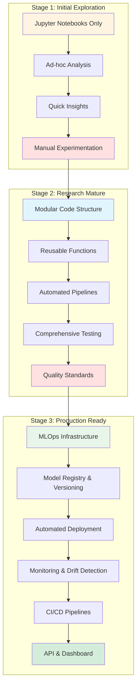

# Rossmann Sales Forecasting: A Data Science Maturity Journey

<!-- badges: start -->

     

<!-- badges: end -->

**A demonstration repository showing how data science projects evolve from initial exploration to production-ready MLOps systems.**

This repository uses the Kaggle Rossmann Store Sales forecasting problem to illustrate three distinct stages of data science maturity. By exploring different branches, you can see how the same problem is approached at different levels of sophistication—from exploratory notebooks to a full MLOps deployment with monitoring, CI/CD, and automated retraining.

______________________________________________________________________

## The Progression

______________________________________________________________________

## Three Branches, Three Maturity Levels

### [Stage 1: Initial Exploration](https://github.com/bradleyboehmke/rossmann-forecasting/tree/1-initial-exploration)

**Branch:** `1-initial-exploration`

**Characteristics:**

- Notebook-centric workflow
- Exploratory data analysis
- Rapid prototyping and experimentation
- Manual model training and evaluation

**Best for:** Early-stage research, proof-of-concept work, learning

### [Stage 2: Research Mature](https://github.com/bradleyboehmke/rossmann-forecasting/tree/2-research-mature)

**Branch:** `2-research-mature`

**Characteristics:**

- Modular code structure (`src/` directory)
- Reusable data processing and feature engineering
- Automated pipelines and testing
- Code quality standards and documentation

**Best for:** Collaborative projects, reproducible research, maintained codebases

### [Stage 3: Production Ready](https://github.com/bradleyboehmke/rossmann-forecasting/tree/main) ← **You are here**

**Branch:** `main`

**Characteristics:**

- Full MLOps infrastructure with MLflow
- Model registry and automated validation
- FastAPI prediction service + Streamlit dashboard
- Prediction logging and data drift detection
- GitHub Actions CI/CD pipelines

**Best for:** Production systems, real-world deployment, business applications

______________________________________________________________________

## What You'll Learn

If you explore each branch, you'll see how data science practices evolve. Key transitions include:

### From Stage 1 → Stage 2

**Key Transitions:**

- Moving from notebooks to modular code
- Creating reusable data pipelines
- Implementing automated testing
- Establishing code quality standards

**Skills:** Software engineering best practices, test-driven development, documentation

### From Stage 2 → Stage 3

**Key Transitions:**

- Experiment tracking with MLflow
- Model registry and lifecycle management
- API deployment with FastAPI
- Monitoring and drift detection
- CI/CD automation

**Skills:** MLOps infrastructure, production deployment, API design, DevOps practices

______________________________________________________________________

## 📚 Complete Documentation

For detailed implementation guides, API reference, and architecture diagrams, visit:

### **[https://bradleyboehmke.github.io/rossmann-forecasting/](https://bradleyboehmke.github.io/rossmann-forecasting/)**

**Documentation includes:**

- Getting Started guides
- DataOps workflows (data processing, validation, versioning)
- ModelOps workflows (MLflow tracking, model registry, lifecycle management)
- Deployment guides (FastAPI, Streamlit, Docker)
- Monitoring and drift detection
- Testing and CI/CD
- Complete API reference

______________________________________________________________________

## 🔑 Feature Comparison

| Feature                | Stage 1 | Stage 2 | Stage 3 |
| ---------------------- | ------- | ------- | ------- |
| Jupyter Notebooks      | ✅      | ✅      | ✅      |
| Modular Code (`src/`)  | ❌      | ✅      | ✅      |
| Automated Testing      | ❌      | ✅      | ✅      |
| Code Quality Standards | ❌      | ✅      | ✅      |
| Documentation (MkDocs) | ❌      | ❌      | ✅      |
| MLflow Tracking        | ❌      | ❌      | ✅      |
| Model Registry         | ❌      | ❌      | ✅      |
| FastAPI Deployment     | ❌      | ❌      | ✅      |
| Streamlit Dashboard    | ❌      | ❌      | ✅      |
| Drift Detection        | ❌      | ❌      | ✅      |
| CI/CD Pipelines        | ❌      | ❌      | ✅      |

______________________________________________________________________

## 🛠️ Technology Stack

- **Core ML:** pandas, numpy, scikit-learn, lightgbm, xgboost, catboost, optuna
- **MLOps:** MLflow, FastAPI, Streamlit, Evidently AI
- **Quality:** pytest, Great Expectations, pre-commit (black, ruff, mdformat)
- **DevOps:** GitHub Actions, Docker, DVC, uv

______________________________________________________________________

## 🤝 Contributing

This is a demonstration repository showing data science maturity progression. Feel free to:

- Fork and adapt for your own projects
- Submit issues for bugs or suggestions
- Use as a template for your ML systems

______________________________________________________________________

## 📄 License

MIT License - See [LICENSE](LICENSE) for details

______________________________________________________________________

## 📞 Contact

**Author:** Bradley Boehmke

**Repository:** [github.com/bradleyboehmke/rossmann-forecasting](https://github.com/bradleyboehmke/rossmann-forecasting)

**Documentation:** [bradleyboehmke.github.io/rossmann-forecasting](https://bradleyboehmke.github.io/rossmann-forecasting/)

______________________________________________________________________

**Ready to explore?** Start with [Stage 1: Initial Exploration](https://github.com/bradleyboehmke/rossmann-forecasting/tree/1-initial-exploration) and work your way up to production! 🚀
