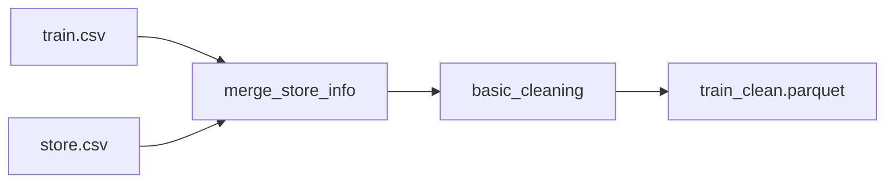

# Data Processing API

This module contains functions for loading, cleaning, and processing raw Rossmann sales data.

## Overview

The data processing pipeline:

1. **Load raw data** - Read `train.csv` and `store.csv`
1. **Merge store info** - Combine sales and store metadata
1. **Clean data** - Handle missing values, convert dtypes, parse dates
1. **Save processed data** - Output to parquet format

## Module Reference

::: src.data.make_dataset options: show_source: true heading_level: 3 show_root_heading: false

## Usage Examples

### Basic Usage

```python
from src.data.make_dataset import load_raw_data, merge_store_info, basic_cleaning

# Load raw data
train_df, store_df = load_raw_data()

# Merge with store information
merged_df = merge_store_info(train_df, store_df)

# Clean the data
clean_df = basic_cleaning(merged_df)
```

### Running the Full Pipeline

```bash
# From command line
python -m src.data.make_dataset

# This will:
# 1. Load data/raw/train.csv and data/raw/store.csv
# 2. Merge and clean the data
# 3. Save to data/processed/train_clean.parquet
```

## Data Flow



## Key Functions

### load_raw_data()

Loads the raw training and store CSV files.

**Returns:**

- `train_df`: Training data with sales records
- `store_df`: Store metadata

### merge_store_info()

Joins training data with store information on the `Store` column.

**Parameters:**

- `train_df`: Training dataframe
- `store_df`: Store metadata dataframe

**Returns:**

- Merged dataframe with both sales and store features

### basic_cleaning()

Performs data cleaning operations:

- Converts `Date` to datetime
- Handles missing values in `CompetitionDistance`
- Handles missing values in `Promo2` fields
- Converts categorical columns to appropriate dtypes

**Parameters:**

- `df`: Merged dataframe

**Returns:**

- Cleaned dataframe ready for feature engineering

## Related Modules

- [Features](features.md) - Feature engineering on cleaned data
- [Models](models.md) - Model training using processed features
