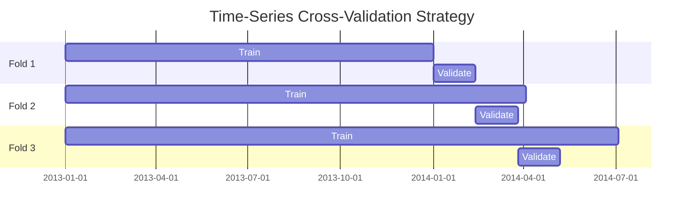

# Evaluation API

This module contains functions for model evaluation, cross-validation, and performance metrics.

## Overview

The evaluation framework provides:

- **Time-series cross-validation** - Expanding window splits
- **RMSPE metric** - Root Mean Square Percentage Error
- **Feature importance** - Analyze model behavior
- **Model comparison** - Compare multiple models

## Module Reference

### Cross-Validation

::: src.evaluation.cv
    options:
      show_source: true
      heading_level: 4
      show_root_heading: false

### Metrics

::: src.evaluation.metrics
    options:
      show_source: true
      heading_level: 4
      show_root_heading: false

## Usage Examples

### Time-Series Cross-Validation

```python
from src.evaluation.cv import make_time_series_folds

# Create expanding window folds
folds = make_time_series_folds(
    df=features_df,
    n_folds=3,
    validation_weeks=6,
    min_train_weeks=52
)

# Each fold contains:
for fold_idx, (train_idx, val_idx) in enumerate(folds):
    X_train, y_train = X.iloc[train_idx], y.iloc[train_idx]
    X_val, y_val = X.iloc[val_idx], y.iloc[val_idx]

    # Train model
    model.fit(X_train, y_train)

    # Evaluate
    preds = model.predict(X_val)
    fold_rmspe = rmspe(y_val, preds)
    print(f"Fold {fold_idx + 1} RMSPE: {fold_rmspe:.4f}")
```

### RMSPE Calculation

```python
from src.evaluation.metrics import rmspe

# Calculate RMSPE (ignores Sales=0 by default)
score = rmspe(y_true, y_pred, ignore_zero_sales=True)
print(f"RMSPE: {score:.4f}")

# Include Sales=0 in calculation (not recommended)
score_with_zeros = rmspe(y_true, y_pred, ignore_zero_sales=False)
```

### Feature Importance

```python
from src.evaluation.metrics import plot_feature_importance

# Plot top 20 most important features
plot_feature_importance(
    model=lgbm_model,
    feature_names=X_train.columns,
    top_n=20,
    save_path="outputs/figures/feature_importance.png"
)
```

## Cross-Validation Strategy

### Expanding Window Approach

Unlike standard K-fold CV, time-series CV uses an **expanding window** to prevent data leakage:

```
Fold 1:  [====================TRAIN====================][==VAL==]
Fold 2:  [==============================TRAIN==============================][==VAL==]
Fold 3:  [==========================================TRAIN==========================================][==VAL==]
```

**Key properties:**

- Each validation fold is 6 weeks (42 days)
- Training data expands with each fold
- No overlap between validation periods
- Mimics real-world forecasting scenario

### Visualization



### Implementation

```python
def make_time_series_folds(df, n_folds=3, validation_weeks=6, min_train_weeks=52):
    """Create expanding window time-series CV folds.

    Args:
        df: DataFrame with Date column
        n_folds: Number of CV folds
        validation_weeks: Weeks in each validation period
        min_train_weeks: Minimum weeks in first training fold

    Returns:
        List of (train_indices, val_indices) tuples
    """
    df = df.sort_values("Date").reset_index(drop=True)
    validation_days = validation_weeks * 7

    folds = []
    for fold in range(n_folds):
        # Calculate validation period
        val_start_day = min_train_weeks * 7 + fold * validation_days
        val_end_day = val_start_day + validation_days

        # Get indices
        train_idx = df[df["Date"] < df["Date"].min() + pd.Timedelta(days=val_start_day)].index
        val_idx = df[
            (df["Date"] >= df["Date"].min() + pd.Timedelta(days=val_start_day)) &
            (df["Date"] < df["Date"].min() + pd.Timedelta(days=val_end_day))
        ].index

        folds.append((train_idx, val_idx))

    return folds
```

## Metrics

### RMSPE (Root Mean Square Percentage Error)

The primary evaluation metric for Rossmann forecasting:

$$ \\text{RMSPE} = \\sqrt{\\frac{1}{n}\\sum\_{i=1}^{n}\\left(\\frac{y_i - \\hat{y}\_i}{y_i}\\right)^2} $$

where:

- $y_i$ = actual sales
- $\\hat{y}\_i$ = predicted sales
- $n$ = number of observations (excluding $y_i = 0$)

**Why RMSPE?**

- Penalizes percentage errors (relative, not absolute)
- Fair comparison across stores with different sales volumes
- Ignores closed stores (Sales=0)

**Implementation:**

```python
def rmspe(y_true, y_pred, ignore_zero_sales=True):
    """Calculate Root Mean Square Percentage Error.

    Args:
        y_true: True sales values
        y_pred: Predicted sales values
        ignore_zero_sales: Exclude Sales=0 from calculation

    Returns:
        RMSPE score (lower is better)
    """
    y_true = np.array(y_true)
    y_pred = np.array(y_pred)

    # Create mask to exclude zero sales
    if ignore_zero_sales:
        mask = y_true != 0
    else:
        mask = np.ones_like(y_true, dtype=bool)

    # Calculate percentage errors
    percentage_errors = (y_true[mask] - y_pred[mask]) / y_true[mask]

    # Return root mean square
    return np.sqrt(np.mean(percentage_errors ** 2))
```

### Other Metrics

While RMSPE is the primary metric, these are useful for diagnostics:

```python
from sklearn.metrics import mean_absolute_error, mean_squared_error, r2_score

# MAE - interpretable absolute error
mae = mean_absolute_error(y_true, y_pred)

# RMSE - penalizes large errors
rmse = np.sqrt(mean_squared_error(y_true, y_pred))

# R² - variance explained
r2 = r2_score(y_true, y_pred)

# MAPE - mean absolute percentage error
mape = np.mean(np.abs((y_true - y_pred) / y_true))
```

## Feature Importance Analysis

### LightGBM Feature Importance

```python
import lightgbm as lgb
import matplotlib.pyplot as plt

# Get feature importance
importance = model.feature_importance(importance_type="gain")
feature_names = X_train.columns

# Sort by importance
indices = np.argsort(importance)[::-1][:20]  # Top 20

# Plot
plt.figure(figsize=(10, 8))
plt.barh(range(20), importance[indices])
plt.yticks(range(20), feature_names[indices])
plt.xlabel("Feature Importance (Gain)")
plt.title("Top 20 Most Important Features")
plt.tight_layout()
plt.savefig("outputs/figures/feature_importance.png")
```

### SHAP Values

```python
import shap

# Create SHAP explainer
explainer = shap.TreeExplainer(model)
shap_values = explainer.shap_values(X_val)

# Summary plot
shap.summary_plot(shap_values, X_val, feature_names=X_val.columns)

# Dependence plot for top feature
shap.dependence_plot("DayOfWeek", shap_values, X_val)
```

## Model Comparison

### Comparing Multiple Models

```python
import pandas as pd

# Collect results
results = []
for model_name, predictions in model_predictions.items():
    score = rmspe(y_true, predictions)
    results.append({
        "Model": model_name,
        "RMSPE": score
    })

# Create comparison table
results_df = pd.DataFrame(results).sort_values("RMSPE")
print(results_df)

# Example output:
#           Model    RMSPE
# 0   Ensemble    0.0978
# 1   LightGBM    0.1024
# 2   XGBoost     0.1031
# 3   CatBoost    0.1045
# 4   Baseline    0.1523
```

## Validation Checks

### Data Leakage Detection

```python
def check_for_leakage(X_train, X_val, y_train, y_val):
    """Verify no data leakage in CV splits."""

    # Check 1: No overlapping indices
    assert len(set(X_train.index) & set(X_val.index)) == 0, "Overlapping indices!"

    # Check 2: Validation data is after training data
    assert X_train["Date"].max() < X_val["Date"].min(), "Temporal leakage!"

    # Check 3: No future features in lag columns
    for lag in [1, 7, 14, 28]:
        train_lag_max = X_train[f"lag_sales_{lag}"].max()
        val_first_sales = y_val.iloc[0]
        # Lag features should not know about validation period
        assert train_lag_max < val_first_sales * 1.5, f"Potential leakage in lag_{lag}"

    print("✓ No data leakage detected")
```

## Key Functions

### cv.py

- `make_time_series_folds()` - Create expanding window CV splits
- `get_fold_date_ranges()` - Get date range for each fold
- `validate_fold_integrity()` - Check for data leakage

### metrics.py

- `rmspe()` - Calculate RMSPE metric
- `rmspe_lgb()` - RMSPE for LightGBM (callback format)
- `plot_feature_importance()` - Visualize feature importance
- `plot_predictions_vs_actual()` - Diagnostic plots

## Related Modules

- [Models](models.md) - Model training using CV framework
- [Features](features.md) - Features evaluated by importance analysis
- [Monitoring](monitoring.md) - Production model evaluation
