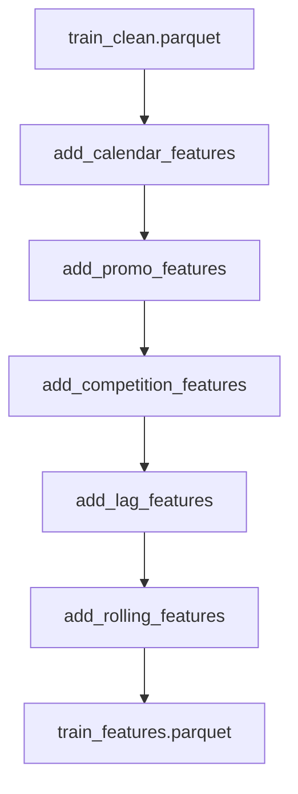

# Feature Engineering API

This module contains functions for creating features from cleaned Rossmann sales data.

## Overview

The feature engineering pipeline creates 32+ standard features organized into categories:

- **Calendar features** - Year, month, week, day-of-week, seasonality
- **Promotion features** - Promo, Promo2, durations, intervals
- **Competition features** - Distance, age, opened flags
- **Lag features** - Store-level lags \[1, 7, 14, 28 days\]
- **Rolling features** - Rolling means and standard deviations

## Module Reference

::: src.features.build_features options: show_source: true heading_level: 3 show_root_heading: false

## Usage Examples

### Basic Usage

```python
from src.features.build_features import (
    add_calendar_features,
    add_promo_features,
    add_competition_features,
    add_lag_features,
    add_rolling_features,
    build_all_features
)

# Build all features at once
df_with_features = build_all_features(clean_df)

# Or build features individually
df = add_calendar_features(clean_df)
df = add_promo_features(df)
df = add_competition_features(df)
df = add_lag_features(df)
df = add_rolling_features(df)
```

### Running the Full Pipeline

```bash
# From command line
python -m src.features.build_features

# This will:
# 1. Load data/processed/train_clean.parquet
# 2. Build all standard features
# 3. Save to data/processed/train_features.parquet
```

## Feature Categories

### Calendar Features

```python
df = add_calendar_features(df)
```

Creates:

- `Year`, `Month`, `Quarter` - Date components
- `DayOfMonth`, `WeekOfYear` - Temporal position
- `IsMonthStart`, `IsMonthEnd` - Month boundary flags
- `Season` - Meteorological season (Winter, Spring, Summer, Fall)

### Promotion Features

```python
df = add_promo_features(df)
```

Creates:

- `Promo2Active` - Whether Promo2 is currently active
- `Promo2Duration` - Days since Promo2 started
- `PromoActiveThisMonth` - Promo2 active in current month based on PromoInterval

### Competition Features

```python
df = add_competition_features(df)
```

Creates:

- `CompetitionDistance` - Log-transformed distance (handles missing values)
- `CompetitionAge` - Days since competition opened
- `HasCompetition` - Binary flag for competition presence

### Lag Features

```python
df = add_lag_features(df, lags=[1, 7, 14, 28])
```

Creates store-level lags:

- `lag_sales_1` - Sales from 1 day ago
- `lag_sales_7` - Sales from 7 days ago (last week)
- `lag_sales_14` - Sales from 14 days ago
- `lag_sales_28` - Sales from 28 days ago (4 weeks)

**IMPORTANT:** Uses `groupby("Store").shift(lag)` to prevent data leakage across stores.

### Rolling Features

```python
df = add_rolling_features(df, windows=[7, 14, 28, 60])
```

Creates store-level rolling statistics:

- `rolling_mean_sales_7` - 7-day average sales
- `rolling_std_sales_7` - 7-day sales volatility
- Similar features for 14, 28, and 60-day windows

**IMPORTANT:** Uses `groupby("Store").rolling(window)` to prevent data leakage across stores.

## Data Flow



## Time-Series Safety

All lag and rolling features are designed to prevent **data leakage**:

```python
# ✅ CORRECT: Store-level lags prevent future data from influencing past
df["lag_sales_7"] = df.groupby("Store")["Sales"].shift(7)

# ❌ WRONG: Global lag would leak data across stores
df["lag_sales_7"] = df["Sales"].shift(7)
```

This ensures:

- Each store's features only use that store's historical data
- No future information leaks into training features
- Time-series cross-validation remains valid

## Key Functions

### build_all_features()

Orchestrates all feature engineering functions in the correct order.

**Parameters:**

- `df`: Cleaned dataframe from data processing

**Returns:**

- Dataframe with 32+ engineered features

**Example:**

```python
features_df = build_all_features(clean_df)
print(features_df.shape)  # (1,017,209, 50+)
```

## Related Modules

- [Data](data.md) - Data loading and cleaning
- [Models](models.md) - Model training using features
- [Evaluation](evaluation.md) - Feature importance analysis
