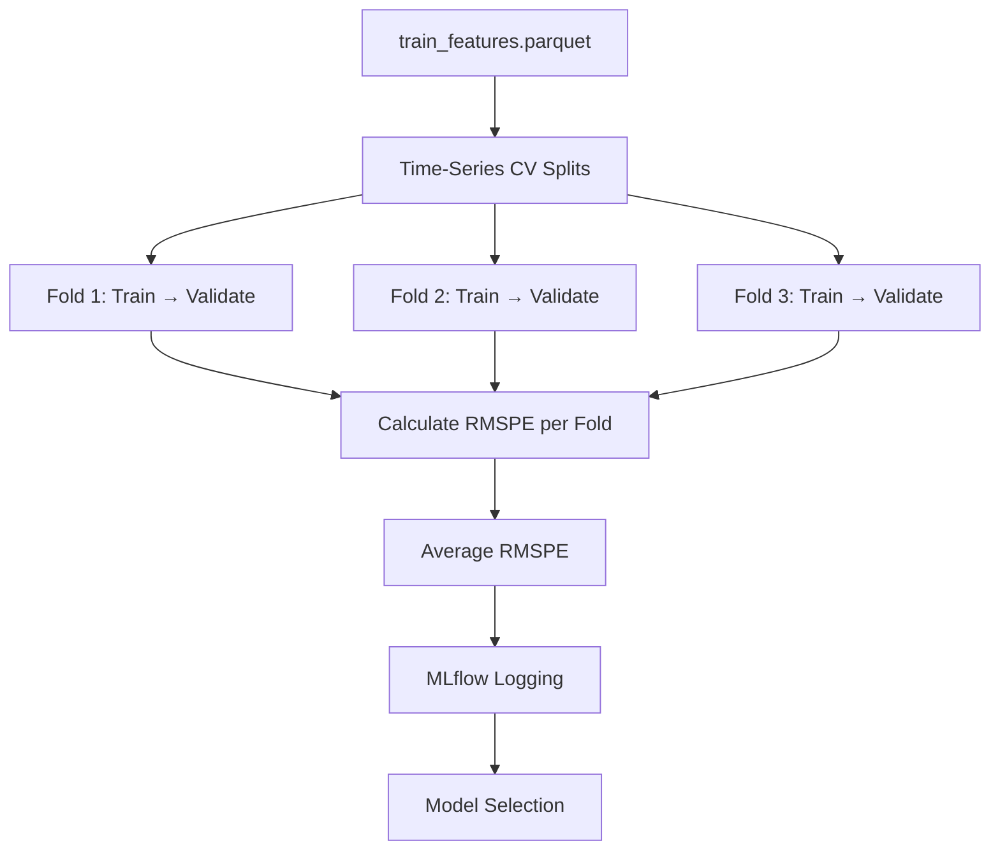

# Models API

This module contains model training functions for baseline and advanced models.

## Overview

The modeling pipeline includes:

- **Baseline models** - Naive forecasts and simple LightGBM
- **Advanced models** - Tuned LightGBM, XGBoost, CatBoost
- **Ensemble models** - Weighted blending and stacking

All models are evaluated using **RMSPE** (Root Mean Square Percentage Error) with time-series cross-validation.

## Module Reference

### Ensemble Model

::: src.models.ensemble
    options:
      show_source: true
      heading_level: 4
      show_root_heading: false

### Model Registry

::: src.models.model_registry
    options:
      show_source: true
      heading_level: 4
      show_root_heading: false

### Training Pipeline

::: src.models.train_ensemble
    options:
      show_source: true
      heading_level: 4
      show_root_heading: false

### Model Validation

::: src.models.validate_model
    options:
      show_source: true
      heading_level: 4
      show_root_heading: false

### Inference Pipeline

::: src.models.predict
    options:
      show_source: true
      heading_level: 4
      show_root_heading: false

## Usage Examples

### Training Baseline Models

```bash
# From command line
python -m src.models.train_baselines

# This will:
# 1. Load data/processed/train_features.parquet
# 2. Create time-series CV folds
# 3. Train naive and simple LightGBM models
# 4. Log results to MLflow
# 5. Print RMSPE scores
```

```python
# From Python
from src.models.train_baselines import train_naive_model, train_simple_lgbm

# Train naive baseline (last week's sales)
rmspe_naive = train_naive_model(df)
print(f"Naive RMSPE: {rmspe_naive:.4f}")

# Train simple LightGBM
rmspe_lgbm = train_simple_lgbm(df)
print(f"Simple LightGBM RMSPE: {rmspe_lgbm:.4f}")
```

### Training Advanced Models

```bash
# From command line
python -m src.models.train_advanced

# This will:
# 1. Load features and CV folds
# 2. Train tuned LightGBM, XGBoost, CatBoost
# 3. Perform hyperparameter optimization
# 4. Log all experiments to MLflow
# 5. Save best models to outputs/models/
```

```python
# From Python
from src.models.train_advanced import train_tuned_lgbm, train_xgboost, train_catboost

# Train tuned models
lgbm_rmspe = train_tuned_lgbm(df, params)
xgb_rmspe = train_xgboost(df, params)
cat_rmspe = train_catboost(df, params)
```

### Creating Ensembles

```python
from src.models.ensembles import weighted_blend, stacked_ensemble

# Weighted blend (simple average or optimized weights)
ensemble_preds = weighted_blend(
    predictions=[lgbm_preds, xgb_preds, cat_preds],
    weights=[0.5, 0.3, 0.2]  # Or optimize with cv
)

# Stacked ensemble (meta-learner)
stacked_preds = stacked_ensemble(
    oof_predictions=[lgbm_oof, xgb_oof, cat_oof],
    test_predictions=[lgbm_test, xgb_test, cat_test],
    y_train=y_train,
    meta_model="lgbm"  # or "linear"
)
```

## Model Types

### Baseline Models

#### Naive Last-Week Model

Predicts today's sales = sales from 7 days ago (same day of week last week).

**Purpose:** Establishes minimum performance threshold.

**Expected RMSPE:** ~0.15-0.20

#### Simple LightGBM

LightGBM with default parameters, no tuning.

**Features used:** All standard features from feature engineering

**Expected RMSPE:** ~0.12-0.15

### Advanced Models

#### Tuned LightGBM

LightGBM with optimized hyperparameters:

- `num_leaves`: 31-127
- `learning_rate`: 0.01-0.1
- `feature_fraction`: 0.7-1.0
- `bagging_fraction`: 0.7-1.0
- `min_child_samples`: 20-100

**Expected RMSPE:** ~0.10-0.11

#### XGBoost

XGBoost with tuned parameters:

- `max_depth`: 3-10
- `learning_rate`: 0.01-0.1
- `subsample`: 0.7-1.0
- `colsample_bytree`: 0.7-1.0

**Expected RMSPE:** ~0.10-0.11

#### CatBoost

CatBoost with categorical feature handling:

- Automatically handles `StoreType`, `Assortment`, etc.
- `depth`: 4-10
- `learning_rate`: 0.01-0.1

**Expected RMSPE:** ~0.10-0.11

### Ensemble Models

#### Weighted Blend

Simple weighted average of model predictions.

**Weights optimization:**

```python
from scipy.optimize import minimize

def objective(weights):
    blend = np.average(predictions, axis=0, weights=weights)
    return rmspe(y_true, blend)

result = minimize(objective, initial_weights, constraints=constraints)
optimal_weights = result.x
```

**Expected RMSPE:** ~0.095-0.100

#### Stacked Ensemble

Uses out-of-fold predictions as features for a meta-learner.

**Architecture:**

```
Base Models (LightGBM, XGBoost, CatBoost)
    ↓
Out-of-Fold Predictions
    ↓
Meta-Model (Linear or LightGBM)
    ↓
Final Predictions
```

**Expected RMSPE:** ~0.095-0.098

## MLflow Integration

All models are logged to MLflow with:

- **Parameters:** Hyperparameters used
- **Metrics:** RMSPE per fold and average
- **Artifacts:** Model files, feature importance plots
- **Tags:** Model type, experiment name

```python
import mlflow

with mlflow.start_run(run_name="tuned_lgbm"):
    # Log parameters
    mlflow.log_params(params)

    # Train model
    model = train_model(X_train, y_train, params)

    # Log metrics
    mlflow.log_metric("rmspe", rmspe_score)

    # Log model
    mlflow.lightgbm.log_model(model, "model")
```

## Model Evaluation Flow



## Key Functions

### train_baselines.py

- `train_naive_model()` - Last-week baseline
- `train_simple_lgbm()` - LightGBM with defaults

### train_advanced.py

- `train_tuned_lgbm()` - Hyperparameter-tuned LightGBM
- `train_xgboost()` - XGBoost model
- `train_catboost()` - CatBoost model

### ensembles.py

- `weighted_blend()` - Weighted average of predictions
- `stacked_ensemble()` - Meta-learner stacking
- `optimize_blend_weights()` - Find optimal ensemble weights

## Related Modules

- [Evaluation](evaluation.md) - Cross-validation and metrics
- [Features](features.md) - Feature engineering for models
- [Monitoring](monitoring.md) - Model performance tracking
