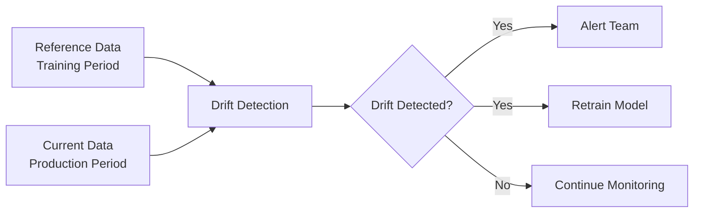

# Monitoring API

This module contains functions for monitoring model performance, detecting data drift, and logging predictions.

## Overview

The monitoring framework provides:

- **Data drift detection** - Identify distribution changes using Evidently
- **Model performance tracking** - Monitor RMSPE over time
- **Prediction logging** - Store and analyze predictions
- **Alerting** - Automated alerts for performance degradation

## Module Reference

!!! info "Coming Soon"
    The monitoring module is currently under development. Monitoring functionality will be added in a future release.

## Usage Examples

### Data Drift Detection

```python
from src.monitoring.drift_detector import detect_data_drift

# Compare training data to production data
drift_report = detect_data_drift(
    reference_data=train_df,
    current_data=production_df,
    categorical_features=["StoreType", "Assortment", "StateHoliday"],
    numerical_features=["Sales", "Customers", "CompetitionDistance"]
)

# Check for drift
if drift_report["dataset_drift"]:
    print("⚠️ Dataset drift detected!")
    print(f"Drifted features: {drift_report['drifted_features']}")
else:
    print("✓ No significant drift detected")
```

### Model Performance Monitoring

```python
from src.monitoring.performance_tracker import track_model_performance

# Log daily predictions and actuals
track_model_performance(
    date="2024-01-15",
    predictions=daily_preds,
    actuals=daily_sales,
    model_version="v2.3",
    metadata={
        "num_stores": 1115,
        "num_predictions": 7805
    }
)

# Get performance trend
from src.monitoring.performance_tracker import get_performance_trend

trend_df = get_performance_trend(days=30)
print(trend_df)

# Example output:
#         Date  RMSPE  MAE    RMSE  Model_Version
# 0  2024-01-01  0.098  245.2  312.1  v2.3
# 1  2024-01-02  0.102  251.8  328.4  v2.3
# 2  2024-01-03  0.095  238.7  298.9  v2.3
```

### Prediction Logging

```python
from src.monitoring.prediction_logger import log_predictions

# Log predictions to database/file
log_predictions(
    predictions=model_preds,
    features=X_production,
    metadata={
        "model_id": "lgbm_v2.3",
        "prediction_date": "2024-01-15",
        "stores": store_ids
    },
    output_path="data/predictions/2024-01-15.parquet"
)
```

## Data Drift Detection

### What is Data Drift?

Data drift occurs when the statistical properties of input features change over time, potentially degrading model performance.

**Types of drift:**

- **Covariate shift** - Feature distributions change
- **Concept drift** - Relationship between features and target changes
- **Label drift** - Target distribution changes

### Evidently Integration

```python
from evidently.report import Report
from evidently.metric_preset import DataDriftPreset, DataQualityPreset

# Create drift report
report = Report(metrics=[
    DataDriftPreset(),
    DataQualityPreset()
])

# Generate report
report.run(
    reference_data=train_df,
    current_data=production_df
)

# Save HTML report
report.save_html("monitoring/reports/drift_report.html")

# Extract drift results
drift_results = report.as_dict()
```

### Custom Drift Detection

```python
def detect_drift_for_feature(reference, current, feature_name):
    """Detect drift for a single feature using Kolmogorov-Smirnov test."""
    from scipy.stats import ks_2samp

    # Perform KS test
    statistic, p_value = ks_2samp(reference[feature_name], current[feature_name])

    # Check if drift detected (p < 0.05)
    is_drifted = p_value < 0.05

    return {
        "feature": feature_name,
        "statistic": statistic,
        "p_value": p_value,
        "is_drifted": is_drifted
    }
```

### Drift Visualization



## Performance Tracking

### Metrics to Monitor

```python
from src.monitoring.performance_tracker import calculate_metrics

metrics = calculate_metrics(y_true, y_pred)

# Returns:
{
    "rmspe": 0.098,
    "mae": 245.2,
    "rmse": 312.1,
    "r2": 0.89,
    "mape": 9.8,
    "prediction_count": 7805,
    "zero_sales_count": 123,
    "negative_predictions": 0  # Should be 0!
}
```

### Time-Series Performance Tracking

```python
import pandas as pd
import matplotlib.pyplot as plt

# Load performance history
perf_df = pd.read_parquet("monitoring/performance_history.parquet")

# Plot RMSPE over time
plt.figure(figsize=(12, 6))
plt.plot(perf_df["Date"], perf_df["RMSPE"], marker="o")
plt.axhline(y=0.11, color="r", linestyle="--", label="Threshold")
plt.xlabel("Date")
plt.ylabel("RMSPE")
plt.title("Model Performance Over Time")
plt.legend()
plt.grid(True)
plt.savefig("monitoring/figures/rmspe_trend.png")
```

### Alerting Logic

```python
def check_performance_degradation(current_rmspe, threshold=0.11, history_days=7):
    """Alert if performance degrades beyond threshold."""

    # Get recent performance
    recent_perf = get_performance_trend(days=history_days)
    avg_recent_rmspe = recent_perf["RMSPE"].mean()

    # Check conditions
    if current_rmspe > threshold:
        send_alert(
            level="CRITICAL",
            message=f"RMSPE {current_rmspe:.4f} exceeds threshold {threshold:.4f}",
            recommendation="Consider retraining model"
        )
    elif current_rmspe > avg_recent_rmspe * 1.1:
        send_alert(
            level="WARNING",
            message=f"RMSPE increased 10% from recent average",
            recommendation="Monitor closely"
        )
    else:
        print("✓ Performance within acceptable range")
```

## Prediction Logging

### Why Log Predictions?

Logging predictions enables:

- **Performance analysis** - Compare predictions to actuals
- **Drift detection** - Monitor prediction distributions
- **Debugging** - Investigate errors on specific stores/dates
- **Compliance** - Audit trail for model decisions

### Prediction Schema

```python
# Structure of logged predictions
prediction_log = pd.DataFrame({
    "Date": ["2024-01-15", "2024-01-15", ...],
    "Store": [1, 2, ...],
    "Predicted_Sales": [5432.1, 6234.5, ...],
    "Actual_Sales": [5123.0, 6402.0, ...],  # Added later
    "Error": [309.1, -167.5, ...],  # Predicted - Actual
    "Percentage_Error": [6.04, -2.61, ...],  # Error / Actual * 100
    "Model_Version": ["v2.3", "v2.3", ...],
    "Timestamp": ["2024-01-15T08:30:00", ...]
})
```

### Querying Predictions

```python
# Load prediction logs
logs = pd.read_parquet("data/predictions/")

# Find worst predictions
worst_errors = logs.nlargest(10, "Percentage_Error")
print(worst_errors[["Date", "Store", "Predicted_Sales", "Actual_Sales", "Percentage_Error"]])

# Analyze by store type
logs_with_meta = logs.merge(store_df, on="Store")
by_store_type = logs_with_meta.groupby("StoreType")["Percentage_Error"].mean()
print(by_store_type)

# Time-based analysis
by_day_of_week = logs.groupby(logs["Date"].dt.dayofweek)["RMSPE"].mean()
```

## Monitoring Dashboard

### Streamlit Dashboard

The project includes a Streamlit dashboard for real-time monitoring:

```bash
# Launch dashboard
streamlit run deployment/streamlit_app.py
```

**Dashboard features:**

- Model performance metrics
- Data drift visualization
- Feature distribution comparisons
- Prediction vs actual charts
- Store-level performance breakdown

### Dashboard Components

```python
import streamlit as st
from src.monitoring.drift_detector import detect_data_drift
from src.monitoring.performance_tracker import get_performance_trend

st.title("Rossmann Sales Forecasting - Model Monitoring")

# Performance section
st.header("Model Performance")
trend_df = get_performance_trend(days=30)
st.line_chart(trend_df.set_index("Date")["RMSPE"])

# Drift detection section
st.header("Data Drift Detection")
if st.button("Run Drift Analysis"):
    drift_report = detect_data_drift(reference_data, current_data)
    if drift_report["dataset_drift"]:
        st.error("⚠️ Drift detected!")
        st.write(drift_report["drifted_features"])
    else:
        st.success("✓ No drift detected")
```

## Automated Monitoring Pipeline

### Daily Monitoring Workflow

```bash
# monitoring/daily_monitoring.sh

#!/bin/bash

# 1. Fetch latest production data
python -m src.data.fetch_production_data

# 2. Detect data drift
python -m src.monitoring.drift_detector \
    --reference data/processed/train_features.parquet \
    --current data/production/latest.parquet

# 3. Track model performance
python -m src.monitoring.performance_tracker \
    --predictions data/predictions/latest.parquet \
    --actuals data/production/actuals.parquet

# 4. Generate report
python -m src.monitoring.generate_report \
    --output monitoring/reports/daily_$(date +%Y%m%d).html

# 5. Check for alerts
python -m src.monitoring.check_alerts
```

### Integration with MLflow

```python
import mlflow

# Log monitoring metrics to MLflow
with mlflow.start_run(run_name="monitoring_2024-01-15"):
    mlflow.log_metric("production_rmspe", 0.098)
    mlflow.log_metric("drift_score", 0.12)
    mlflow.log_metric("num_drifted_features", 3)
    mlflow.log_artifact("monitoring/reports/drift_report.html")
```

## Key Functions

### drift_detector.py

- `detect_data_drift()` - Run drift detection on reference vs current data
- `detect_drift_per_feature()` - Detect drift for individual features
- `generate_drift_report()` - Create HTML drift report

### performance_tracker.py

- `track_model_performance()` - Log daily performance metrics
- `get_performance_trend()` - Retrieve performance history
- `check_performance_degradation()` - Alert on performance issues
- `calculate_metrics()` - Compute all evaluation metrics

### prediction_logger.py

- `log_predictions()` - Store predictions to file/database
- `load_prediction_logs()` - Retrieve historical predictions
- `analyze_prediction_errors()` - Identify systematic errors

## Related Modules

- [Evaluation](evaluation.md) - Metrics used in monitoring
- [Models](models.md) - Models being monitored
- [Data](data.md) - Data sources for drift detection
