# Pipeline Automation

The individual DataOps steps can be chained together into automated workflows. This page explains two approaches: Bash scripts for simplicity and DVC pipelines for intelligent caching.

______________________________________________________________________

## Option 1: Bash Script Automation

We provide a complete automation script at [`scripts/dataops_workflow.sh`](../../scripts/dataops_workflow.sh):

```bash
# Run the complete automated workflow
bash scripts/dataops_workflow.sh
```

### What It Does

1. ✅ Validates raw data (Step 1)
1. 🔧 Processes raw → clean data (Step 2)
1. ✅ Validates processed data (Step 3)
1. 🎯 Builds standard features (Step 4)
1. ✅ Validates features (Step 5)
1. 💾 Versions data with DVC (Step 6)

### Exit Behavior

The script exits immediately if **any** validation fails, preventing bad data from propagating through the pipeline.

### Use Cases

- **Scheduled jobs** (cron, GitHub Actions)
- **CI/CD pipelines** (run on every data update)
- **Manual full refreshes** (reprocess everything from scratch)

______________________________________________________________________

## Option 2: DVC Pipeline Automation

For even more automation, use DVC's built-in pipeline orchestration (defined in [`dvc.yaml`](../../dvc.yaml)):

```bash
# Run entire pipeline (only re-runs changed stages)
dvc repro
```

### Advantages of DVC Pipeline

- **Smart caching**: Only re-runs stages if dependencies changed
- **Dependency tracking**: Automatically detects which steps need re-running
- **Parallel execution**: Runs independent stages concurrently
- **Metrics tracking**: Can track data quality metrics over time

### Example: Incremental Updates

If only `src/features/build_features.py` changed, `dvc repro` will:

1. ✅ Skip raw data validation (unchanged)
1. ✅ Skip data processing (unchanged)
1. ✅ Skip processed validation (unchanged)
1. ⚙️ Re-run feature engineering (code changed)
1. ⚙️ Re-run feature validation (features changed)

______________________________________________________________________

## Comparison: Bash vs DVC

### Visual Comparison

```mermaid
flowchart TB
    subgraph Option1["Option 1: Bash Script (scripts/dataops_workflow.sh)"]
        direction TB
        B1[🔧 Shell orchestration]
        B2[Sequential execution<br/>with exit-on-error]
        B3[Runs ALL steps<br/>every time]
        B1 --> B2 --> B3
    end

    subgraph Option2["Option 2: DVC Pipeline (dvc.yaml)"]
        direction TB
        D1[📋 Declarative config]
        D2[Smart dependency<br/>tracking]
        D3[Only reruns<br/>changed stages]
        D1 --> D2 --> D3
    end

    subgraph Steps["DataOps Steps (Both Options)"]
        direction LR
        S1[1️⃣ Validate<br/>Raw] --> S2[2️⃣ Process<br/>Data]
        S2 --> S3[3️⃣ Validate<br/>Processed]
        S3 --> S4[4️⃣ Build<br/>Features]
        S4 --> S5[5️⃣ Validate<br/>Features]
        S5 --> S6[6️⃣ Version<br/>with DVC]
    end

    Option1 -.orchestrates.-> Steps
    Option2 -.orchestrates.-> Steps

    subgraph Output["Final Output"]
        O1[✅ Validated data<br/>✅ Versioned artifacts<br/>✅ Ready for ModelOps]
    end

    Steps --> Output

    style Option1 fill:#e0f2f1
    style Option2 fill:#f3e5f5
    style Steps fill:#fff9c4
    style Output fill:#e8f5e9
    style B3 fill:#ffecb3
    style D3 fill:#e1bee7
```



### Feature Comparison

| Feature         | Bash Script                        | DVC Pipeline           |
| --------------- | ---------------------------------- | ---------------------- |
| **Execution**   | Sequential, all steps              | Smart, only changed    |
| **Speed**       | Slower (full rebuild)              | Faster (caching)       |
| **Simplicity**  | Easy to understand                 | Requires DVC knowledge |
| **Best For**    | CI/CD, scheduled jobs              | Development iteration  |
| **Command**     | `bash scripts/dataops_workflow.sh` | `dvc repro`            |
| **Debugging**   | Standard shell debugging           | DVC-specific tools     |
| **Portability** | Bash required                      | DVC + Python required  |

### When to Use Each

**Use Bash Script when:**

- Running in CI/CD pipelines (GitHub Actions, Jenkins)
- Deploying to production environments
- Scheduling with cron or Airflow
- You want simple, transparent execution
- Team is unfamiliar with DVC

**Use DVC Pipeline when:**

- Developing locally and iterating quickly
- Experimenting with feature engineering changes
- You want automatic dependency tracking
- Team is comfortable with DVC
- Performance optimization matters

______________________________________________________________________

## Integration with Orchestration Tools

### GitHub Actions Example

```yaml
name: DataOps Pipeline

on:
  schedule:
    - cron: '0 2 * * 1'  # Weekly on Monday at 2 AM
  workflow_dispatch:  # Manual trigger

jobs:
  dataops:
    runs-on: ubuntu-latest
    steps:
      - uses: actions/checkout@v3

      - name: Setup Python
        uses: actions/setup-python@v4
        with:
          python-version: '3.10'

      - name: Install dependencies
        run: |
          pip install uv
          uv pip install -e .

      - name: Run DataOps pipeline
        run: bash scripts/dataops_workflow.sh

      - name: Upload validation reports
        if: failure()
        uses: actions/upload-artifact@v3
        with:
          name: validation-reports
          path: great_expectations/uncommitted/validations/
```

### Apache Airflow Example

```python
from airflow import DAG
from airflow.operators.bash import BashOperator
from datetime import datetime, timedelta

default_args = {
    'owner': 'data-team',
    'depends_on_past': False,
    'email_on_failure': True,
    'email': ['data-team@company.com'],
    'retries': 1,
    'retry_delay': timedelta(minutes=5),
}

with DAG(
    'rossmann_dataops',
    default_args=default_args,
    description='DataOps pipeline for Rossmann forecasting',
    schedule_interval='0 2 * * 1',  # Weekly on Monday at 2 AM
    start_date=datetime(2024, 1, 1),
    catchup=False,
) as dag:

    validate_raw = BashOperator(
        task_id='validate_raw_data',
        bash_command='python src/data/validate_data.py --stage raw --fail-on-error',
    )

    process_data = BashOperator(
        task_id='process_data',
        bash_command='python -m src.data.make_dataset',
    )

    validate_processed = BashOperator(
        task_id='validate_processed_data',
        bash_command='python src/data/validate_data.py --stage processed --fail-on-error',
    )

    build_features = BashOperator(
        task_id='build_features',
        bash_command='python -m src.features.build_features',
    )

    validate_features = BashOperator(
        task_id='validate_features',
        bash_command='python src/data/validate_data.py --stage features --fail-on-error',
    )

    version_data = BashOperator(
        task_id='version_with_dvc',
        bash_command='''
            dvc add data/processed/train_clean.parquet
            dvc add data/processed/train_features.parquet
            dvc push
        ''',
    )

    # Define dependencies
    validate_raw >> process_data >> validate_processed
    validate_processed >> build_features >> validate_features
    validate_features >> version_data
```

______________________________________________________________________

## What Happens Next: Model Retraining

Once the DataOps pipeline completes successfully, **the next step is ModelOps**: training or retraining ML models on the fresh data.

### Typical ModelOps Workflow

```mermaid
flowchart LR
    A[✅ DataOps Complete] --> B[🔄 Trigger Model Training]
    B --> C[📊 Load train_features.parquet]
    C --> D[⏱️ Time-Series CV Split]
    D --> E[🎯 Train Models]
    E --> F[📈 Evaluate RMSPE]
    F --> G{Better than<br/>current model?}
    G -->|YES| H[🚀 Deploy New Model]
    G -->|NO| I[📋 Log Results, Keep Current]

    style A fill:#e8f5e9
    style B fill:#e1f5ff
    style H fill:#c8e6c9
    style I fill:#fff9c4
```



### Steps

1. **Load Features**: Read `data/processed/train_features.parquet`
1. **Time-Series Split**: Create expanding window CV folds (respecting temporal order)
1. **Train Models**: LightGBM, XGBoost, CatBoost with hyperparameter tuning
1. **Evaluate**: Calculate RMSPE on validation folds
1. **Compare**: Check if new model beats current production model
1. **Deploy**: If better, deploy new model; otherwise, keep current

### Automation Trigger

In a production system, successful completion of the DataOps pipeline can automatically trigger model retraining via:

- **Airflow DAG**: `dataops_workflow >> model_training_workflow`
- **GitHub Actions**: Workflow dispatch event
- **MLflow Projects**: `mlflow run` command
- **Kubeflow Pipelines**: Conditional step

______________________________________________________________________

## Next Steps

- **[Real-World Scenarios](scenarios.md)** - See automation in action with new data arrivals
- **[Best Practices](best-practices.md)** - Production-grade automation strategies
- **[Model Training](../modelops/training.md)** - Full ModelOps workflow
