# DataOps Overview

This DataOps workflow demonstrates how a professional data pipeline operates in production environments. The workflow is designed around a realistic scenario: **Rossmann receives updated sales and store data on a regular basis (daily or weekly)**, which adds more historical observations over time.

______________________________________________________________________

## What is DataOps?

**DataOps** applies DevOps principles to data analytics and machine learning pipelines. It emphasizes:

- **Automation** - Eliminate manual data processing steps
- **Quality** - Validate data at every stage
- **Reproducibility** - Version data alongside code
- **Collaboration** - Enable teams to work with consistent, trusted data
- **Continuous Improvement** - Support iterative model updates as new data arrives

As new raw data arrives, this automated pipeline ensures that:

1. **Data quality is verified** before any processing begins
1. **Processing is consistent and reproducible** across all data updates
1. **Features are engineered systematically** using proven transformations
1. **All data artifacts are versioned** for reproducibility and rollback capability
1. **The pipeline is ready to trigger model retraining** automatically

This approach transforms data operations from manual, error-prone tasks into a **reliable, automated system** that supports continuous model improvement as new data becomes available.

!!! info "Tool Alternatives" The tools demonstrated here (Great Expectations, DVC) represent one of many valid approaches to DataOps. Alternative tools include:

```
- **Data Validation**: Deequ (Apache Spark), Pandera, TensorFlow Data Validation
- **Data Versioning**: Delta Lake, LakeFS, Pachyderm, Git LFS
- **Orchestration**: Apache Airflow, Prefect, Dagster, Kubeflow Pipelines

The principles remain the same regardless of tooling choices.
```

______________________________________________________________________

## High-Level DataOps Flow

```mermaid
flowchart TD
    A[📥 New Raw Data Arrives] --> B[🔍 Validate Raw Data]
    B -->|PASS| C[🔧 Process & Clean Data]
    B -->|FAIL| X[❌ Alert & Stop]
    C --> D[✅ Validate Processed Data]
    D -->|PASS| E[🎯 Build Standard Features]
    D -->|FAIL| X
    E --> F[✅ Validate Features]
    F -->|PASS| G[💾 Version with DVC]
    F -->|FAIL| X
    G --> H[🔄 Trigger Model Retraining]

    style A fill:#e1f5ff
    style B fill:#fff4e1
    style C fill:#e8f5e9
    style D fill:#fff4e1
    style E fill:#e8f5e9
    style F fill:#fff4e1
    style G fill:#f3e5f5
    style H fill:#e1f5ff
    style X fill:#ffebee
```



**Key Stages:**

1. **Validation Gates** (🔍): Prevent bad data from entering the pipeline
1. **Processing Steps** (🔧): Transform raw data into clean, usable formats
1. **Feature Engineering** (🎯): Create standard, proven features for modeling
1. **Versioning** (💾): Track all data artifacts for reproducibility
1. **Automation Trigger** (🔄): Signal that new data is ready for model retraining

______________________________________________________________________

## Pipeline Components

### Data Validation (Great Expectations)

Great Expectations provides automated data quality checks at three critical stages:

- **Raw data validation** - Catches schema changes, missing values, invalid ranges
- **Processed data validation** - Ensures cleaning didn't introduce errors
- **Feature validation** - Verifies feature engineering correctness

**Benefits:**

- Fail fast when data quality issues arise
- Prevent bad data from reaching models
- Document data assumptions as executable code

### Data Processing (Python Scripts)

Core data transformation scripts:

- **`make_dataset.py`** - Merges raw files, cleans data, handles missing values
- **`build_features.py`** - Engineers calendar, promo, lag, and rolling features

**Benefits:**

- Consistent, reproducible transformations
- Tested and version-controlled code
- Easy to debug and modify

### Data Versioning (DVC)

DVC tracks large data files separately from Git:

- Stores metadata (`.dvc` files) in Git
- Stores actual data in local cache or cloud storage
- Enables data rollback and lineage tracking

**Benefits:**

- Reproduce exact data state for any model version
- Share large datasets without Git bloat
- Track which data version produced which model

______________________________________________________________________

## Quick Start

Run the complete DataOps pipeline in one command:

```bash
# Automated end-to-end workflow
bash scripts/dataops_workflow.sh
```

This executes all six pipeline steps:

1. Validate raw data
1. Process and clean
1. Validate processed data
1. Build features
1. Validate features
1. Version with DVC

**Expected output:**

```
============================================================
Step 1: Validating raw data...
============================================================
✓ PASSED (13/13 expectations)

============================================================
Step 2: Processing raw data...
============================================================
✓ Processed 1,017,209 records
✓ Saved to: data/processed/train_clean.parquet

============================================================
Step 3: Validating processed data...
============================================================
✓ PASSED (15/15 expectations)

... (continues through Step 6)
```

______________________________________________________________________

## Why This Matters

**Without DataOps:**

- ❌ Manual data processing prone to errors
- ❌ Inconsistent features across team members
- ❌ No data quality checks before modeling
- ❌ Can't reproduce past model results
- ❌ Difficult to roll back to previous data versions

**With DataOps:**

- ✅ Automated, tested data pipelines
- ✅ Consistent features for all team members
- ✅ Quality gates prevent bad data from propagating
- ✅ Full reproducibility via versioning
- ✅ Easy rollback and experimentation

______________________________________________________________________

## Next Steps

Explore each aspect of the DataOps pipeline in detail:

1. **[Individual Steps](steps.md)** - Detailed walkthrough of each pipeline stage
1. **[Data Validation](validation.md)** - Understanding Great Expectations
1. **[Automation](automation.md)** - Orchestrating with Bash scripts and DVC pipelines
1. **[Real-World Scenarios](scenarios.md)** - Practical examples of handling new data
1. **[Best Practices](best-practices.md)** - Production-grade recommendations
