# Individual DataOps Steps

Each step in the workflow serves a specific purpose and can be run independently for debugging, testing, or incremental updates.

______________________________________________________________________

## Step 1: Validate Raw Data

**Purpose:** Ensure incoming data meets quality expectations **before** investing time in processing. This early validation catches issues like:

- Schema changes (missing columns, wrong data types)
- Value range violations (negative sales, invalid dates)
- Data corruption or formatting errors
- Unexpected nulls in critical fields

**Why This Matters:** Processing bad data wastes compute resources and can introduce subtle bugs that propagate through the entire pipeline. Failing fast at the validation gate saves time and prevents downstream issues.

### Run This Step

```bash
python src/data/validate_data.py --stage raw --fail-on-error
```

### What It Validates

- ✅ Expected columns present (`Store`, `Date`, `Sales`, etc.)
- ✅ Data types correct (dates are datetime, sales are numeric)
- ✅ Value ranges valid (sales ≥ 0, stores in expected range)
- ✅ Cardinality checks (reasonable number of stores, dates)
- ✅ Critical fields non-null

### Success Output

```
============================================================
Validating raw training data: data/raw/train.csv
============================================================
✓ PASSED
Total expectations: 13
Successful: 13
Failed: 0
Success rate: 100.0%
```

### Failure Handling

If validation fails, the script exits with an error code, preventing the pipeline from continuing. This is intentional—**bad data should stop the pipeline**, not be silently processed.

______________________________________________________________________

## Step 2: Process Raw Data

**Purpose:** Transform raw CSV files into a clean, merged, analysis-ready dataset. This step performs:

- **Merging**: Combining `train.csv` + `store.csv` on the `Store` key
- **Type Conversion**: Parsing dates, converting categoricals, optimizing dtypes
- **Missing Value Handling**: Filling nulls with business-appropriate defaults
- **Format Optimization**: Saving as Parquet (compressed, columnar format)

**Why This Matters:** Raw data is rarely ready for analysis or modeling. Consistent processing ensures that every data scientist working with this data sees the same clean version, eliminating "works on my machine" issues.

### Run This Step

```bash
python -m src.data.make_dataset
```

### What It Does

1. Loads `data/raw/train.csv` (1M+ rows of daily sales)
1. Loads `data/raw/store.csv` (1,115 store metadata records)
1. Merges on `Store` column (left join preserves all sales records)
1. Converts `Date` to datetime, `StateHoliday` to category, etc.
1. Fills missing `CompetitionDistance` with median
1. Fills missing `Promo2` metadata with zeros
1. Saves to `data/processed/train_clean.parquet`

### Output File

`data/processed/train_clean.parquet` (~30 MB, compressed)

### Verify Success

```bash
# Check file exists and size
ls -lh data/processed/train_clean.parquet

# Quick inspection
python -c "
import pandas as pd
df = pd.read_parquet('data/processed/train_clean.parquet')
print(f'✓ Rows: {len(df):,}')
print(f'✓ Columns: {len(df.columns)}')
print(f'✓ Date range: {df.Date.min()} to {df.Date.max()}')
print(f'✓ Stores: {df.Store.nunique()}')
"
```

______________________________________________________________________

## Step 3: Validate Processed Data

**Purpose:** Confirm that processing was successful and the cleaned data maintains quality standards. This catches:

- Processing bugs (e.g., merge duplicates rows)
- Type conversion errors
- Unexpected nulls introduced during processing
- Data loss (e.g., rows accidentally filtered)

**Why This Matters:** Even well-tested code can fail in unexpected ways. Post-processing validation acts as a **safety net** to catch issues before features are engineered.

### Run This Step

```bash
python src/data/validate_data.py --stage processed --fail-on-error
```

### What It Validates

- ✅ All columns from raw data preserved (plus merge additions)
- ✅ No unexpected nulls in critical columns
- ✅ Date range is reasonable
- ✅ Store counts match expectations
- ✅ Sales values are non-negative

______________________________________________________________________

## Step 4: Build Standard Features

**Purpose:** Create **proven, standard features** that are always useful for Rossmann forecasting models. These are features that have been validated across multiple modeling efforts and should be consistently available.

**Standard features include:**

- **Calendar features**: Year, month, quarter, season, weekend flags
- **Promotion features**: Promo2 active status, duration, intervals
- **Competition features**: Log-scaled distance, age, presence flags
- **Lag features**: Sales from 1, 7, 14, 28 days ago (per store)
- **Rolling features**: 7/14/28/60-day rolling means and standard deviations (per store)

**Why This Matters:** Separating standard features (DataOps) from experimental features (ModelOps) creates a clear boundary:

- **DataOps**: Automated, tested, always created
- **ModelOps**: Experimental, model-specific, optional

This separation enables **faster experimentation** (modelers don't wait for data engineers) and **better reliability** (standard features are thoroughly tested).

### Run This Step

```bash
python -m src.features.build_features
```

### What It Does

1. Loads `data/processed/train_clean.parquet`
1. Adds calendar features (12 features)
1. Adds promotion features (5 features)
1. Adds competition features (3 features)
1. Adds lag features (4 features, grouped by store)
1. Adds rolling features (8 features, grouped by store)
1. Saves to `data/processed/train_features.parquet`

### Output File

`data/processed/train_features.parquet` (~50 MB, 32 new features)

### Critical Detail

Lag and rolling features **must** use `groupby('Store')` to prevent data leakage across stores. This is tested in `tests/test_features.py`.

______________________________________________________________________

## Step 5: Validate Features

**Purpose:** Ensure feature engineering didn't introduce bugs, nulls, or invalid values.

**Why This Matters:** Feature engineering involves complex transformations (lags, rolling windows, date parsing). Validation catches errors like:

- Infinite values from log transformations
- NaN propagation from rolling windows
- Incorrect groupby logic (leakage across stores)

### Run This Step

```bash
python src/data/validate_data.py --stage features --fail-on-error
```

______________________________________________________________________

## Step 6: Version Control with DVC

**Purpose:** Track data artifacts (processed data, features) separately from code, enabling:

- **Reproducibility**: Return to exact data state for any model version
- **Collaboration**: Share large datasets without Git bloat
- **Rollback**: Revert to previous data version if issues arise
- **Lineage**: Track which data version produced which model

**Why This Matters:** Git is designed for code, not data. Versioning 100MB+ parquet files in Git causes:

- Repository bloat (slow clones)
- Merge conflicts on binary files
- Poor diff capabilities

DVC solves this by storing **metadata in Git** (small `.dvc` files) and **data in external storage** (local cache or cloud).

### Run This Step

```bash
# Track processed data with DVC
dvc add data/processed/train_clean.parquet
dvc add data/processed/train_features.parquet

# Commit .dvc metadata to Git
git add data/processed/*.dvc .gitignore
git commit -m "data: version processed data and features

- Processed 1,017,209 sales records
- Created 32 standard features
- Validation: PASSED
- Date range: 2013-01-01 to 2015-07-31"
```

### What This Creates

- `train_clean.parquet.dvc`: Metadata file (MD5 hash, file size) tracked in Git
- `train_features.parquet.dvc`: Metadata file tracked in Git
- Actual data files: Moved to `.dvc/cache/` (excluded from Git)
- Updated `.gitignore`: Ensures data files aren't committed to Git

### Optional: Push to Remote

```bash
# Configure remote (one-time, if using cloud storage)
dvc remote add -d myremote s3://my-bucket/rossmann-data

# Push data to remote
dvc push
```

______________________________________________________________________

## Complete Pipeline Diagram

The diagram below shows how **data assets**, **Python scripts**, **validation suites**, and **DVC versioning** work together across Steps 1-6:

```mermaid
flowchart TB
    subgraph Step1["📍 Step 1: Validate Raw Data"]
        direction LR
        R1[📁 data/raw/<br/>train.csv + store.csv]
        GX1[📋 GX Suite:<br/>raw_data]
        V1[🐍 validate_data.py<br/>--stage raw]
        R1 --> V1
        GX1 -.expectations.-> V1
    end

    V1 -->|✅ PASS| Step2
    V1 -->|❌ FAIL| Stop1[❌ STOP PIPELINE]

    subgraph Step2["📍 Step 2: Process Data"]
        direction LR
        P1[🐍 make_dataset.py<br/>merge + clean]
        OUT1[📁 data/processed/<br/>train_clean.parquet]
        P1 --> OUT1
    end

    OUT1 --> Step3

    subgraph Step3["📍 Step 3: Validate Processed Data"]
        direction LR
        GX2[📋 GX Suite:<br/>processed_data]
        V2[🐍 validate_data.py<br/>--stage processed]
        GX2 -.expectations.-> V2
    end

    V2 -->|✅ PASS| Step4
    V2 -->|❌ FAIL| Stop2[❌ STOP PIPELINE]

    subgraph Step4["📍 Step 4: Build Features"]
        direction LR
        F1[🐍 build_features.py<br/>lags + rolling + calendar]
        OUT2[📁 data/processed/<br/>train_features.parquet]
        F1 --> OUT2
    end

    OUT2 --> Step5

    subgraph Step5["📍 Step 5: Validate Features"]
        direction LR
        GX3[📋 GX Suite:<br/>features]
        V3[🐍 validate_data.py<br/>--stage features]
        GX3 -.expectations.-> V3
    end

    V3 -->|✅ PASS| Step6
    V3 -->|❌ FAIL| Stop3[❌ STOP PIPELINE]

    subgraph Step6["📍 Step 6: Version with DVC"]
        direction LR
        DVC1[⚙️ dvc add<br/>both parquet files]
        META1[📄 *.dvc metadata<br/>tracked in Git]
        CACHE1[💾 .dvc/cache/<br/>data storage]
        DVC1 --> META1
        DVC1 --> CACHE1
    end

    Step6 --> Success[✅ Pipeline Complete<br/>Ready for ModelOps]

    style Stop1 fill:#ffebee,stroke:#c62828,stroke-width:3px
    style Stop2 fill:#ffebee,stroke:#c62828,stroke-width:3px
    style Stop3 fill:#ffebee,stroke:#c62828,stroke-width:3px
    style R1 fill:#e3f2fd
    style OUT1 fill:#e8f5e9
    style OUT2 fill:#e8f5e9
    style GX1 fill:#f3e5f5
    style GX2 fill:#f3e5f5
    style GX3 fill:#f3e5f5
    style META1 fill:#fce4ec
    style CACHE1 fill:#f1f8e9
    style Success fill:#c8e6c9,stroke:#2e7d32,stroke-width:3px
    style Step1 fill:#f5f5f5
    style Step2 fill:#f5f5f5
    style Step3 fill:#f5f5f5
    style Step4 fill:#f5f5f5
    style Step5 fill:#f5f5f5
    style Step6 fill:#f5f5f5
```



**How the Pipeline Flows:**

1. **Step 1**: Raw CSV files are validated against Great Expectations suite → PASS/FAIL gate
1. **Step 2**: Processing script reads raw files, merges, cleans, outputs parquet
1. **Step 3**: Processed data validated against GX suite → PASS/FAIL gate
1. **Step 4**: Feature engineering script reads processed data, creates features
1. **Step 5**: Features validated against GX suite → PASS/FAIL gate
1. **Step 6**: DVC versions both processed files, creates `.dvc` metadata (Git) and caches data

**Legend:**

- 📁 **Data files** (CSV/Parquet)
- 🐍 **Python scripts** (executable code)
- 📋 **Great Expectations suites** (validation rules)
- 📄 **DVC metadata** (tracked in Git)
- 💾 **DVC cache** (actual data storage)
- Solid arrows (→) = main data flow
- Dotted arrows (-.->)= supporting relationships

______________________________________________________________________

## Next Steps

- **[Data Validation](validation.md)** - Learn about Great Expectations and validation suites
- **[Automation](automation.md)** - Orchestrate with Bash scripts and DVC pipelines
- **[Real-World Scenarios](scenarios.md)** - See how to handle new data arrivals
