# FastAPI Prediction Service

## Overview

The FastAPI service is the **model serving layer** that loads trained ensemble models from MLflow and serves predictions via REST API. It acts as the bridge between the MLflow Model Registry and client applications (Streamlit UI, batch scripts, external systems).

**Location:** `deployment/api/`

**Port:** 8000

**Framework:** FastAPI + Uvicorn ASGI server

## Why FastAPI?

FastAPI is the de facto standard for ML model serving in Python because it provides:

- **Automatic API documentation:** Interactive docs at `/docs` (Swagger UI)
- **Type validation:** Pydantic models ensure request/response correctness
- **Async support:** Handle concurrent requests efficiently
- **Production-ready:** Works with ASGI servers (Uvicorn, Hypercorn)
- **Developer experience:** Fast development with automatic OpenAPI schema

## Service Architecture


## Core Components

The FastAPI service is built from three essential components that work together to provide a robust prediction API. Understanding each component's role will help you customize and extend the service for your needs. These components follow a clean separation of concerns: application setup, model orchestration, and data validation.

### 1. Application Entry Point (`main.py`)

**Purpose:** FastAPI application definition and startup logic

**Key code:**

```python
@app.on_event("startup")
async def startup_event():
    """Load model on startup."""
    global model_manager
    model_manager = ModelManager()
    model_manager.load_model(stage="Production")
```

**Why load on startup?**

- **Performance:** Model is loaded once, not on every request
- **Fast predictions:** Subsequent requests use cached model
- **Fail-fast:** If model loading fails, app won't start (prevents serving with no model)

**Endpoints defined:**

- `GET /` - Root endpoint with service info
- `GET /health` - Health check for load balancers
- `GET /model/info` - Model registry information
- `POST /model/load` - Load a specific model version/stage
- `POST /predict` - Generate predictions (main endpoint)

### 2. Model Manager (`model_manager.py`)

**Purpose:** Abstraction layer for model loading and prediction

**Key responsibilities:**

- Load models from MLflow by stage (Production, Staging) or version number
- Cache loaded model to avoid repeated MLflow calls
- Orchestrate complete prediction pipeline
- Handle errors gracefully

**Model loading:**

```python
def load_model(self, stage: str = "Production") -> None:
    """Load model from MLflow Model Registry."""
    model_uri = f"models:/rossmann-ensemble/{stage}"
    self.model = mlflow.pyfunc.load_model(model_uri)
    self.model_version = get_model_version("rossmann-ensemble", stage)
```

**Prediction pipeline:**

```python
def predict(self, input_data: pd.DataFrame) -> np.ndarray:
    """Complete prediction pipeline."""
    # 1. Validate input
    validate_input_data(input_data)

    # 2. Prepare features (merge metadata, clean, engineer)
    features = prepare_prediction_data(input_data)

    # 3. Generate predictions
    predictions = self.model.predict(features)

    return predictions
```

### 3. Request/Response Models (`schemas.py`)

**Purpose:** Type-safe API contracts using Pydantic

**Input schema (matches train.csv):**

```python
class PredictionInput(BaseModel):
    """Single prediction input in train.csv format."""
    Store: int = Field(..., ge=1, le=1115)
    DayOfWeek: int = Field(..., ge=1, le=7)
    Date: str = Field(..., regex=r"^\d{4}-\d{2}-\d{2}$")
    Open: int = Field(..., ge=0, le=1)
    Promo: int = Field(..., ge=0, le=1)
    StateHoliday: str = Field(..., regex=r"^[0abc]$")
    SchoolHoliday: int = Field(..., ge=0, le=1)
```

**Benefits:**

- **Automatic validation:** FastAPI rejects invalid requests with clear errors
- **Auto-generated docs:** Swagger UI shows expected format with examples
- **Type safety:** IDE autocomplete and type checking

**Response schema:**

```python
class PredictionResponse(BaseModel):
    """Prediction response with metadata."""
    predictions: list[float]
    model_version: int
    model_stage: str
    count: int
```

## API Endpoints

The service exposes five RESTful endpoints that handle everything from health monitoring to predictions. These endpoints follow REST conventions and provide comprehensive functionality for both operational monitoring and business use. All endpoints return JSON responses and include proper error handling with meaningful HTTP status codes.

### Health Check

```http
GET /health
```

**Purpose:** Load balancer health checks, monitoring

**Response:**

```json
{
  "status": "healthy",
  "model_loaded": true,
  "model_version": 3,
  "model_stage": "Production"
}
```

### Model Information

```http
GET /model/info
```

**Purpose:** Query model registry status

**Response:**

```json
{
  "production_version": 3,
  "staging_version": 4,
  "registered_models": [
    "rossmann-ensemble"
  ]
}
```

### Generate Predictions

```http
POST /predict
```

**Purpose:** Main prediction endpoint

**Request body:**

```json
{
  "inputs": [
    {
      "Store": 1,
      "DayOfWeek": 5,
      "Date": "2015-08-01",
      "Open": 1,
      "Promo": 1,
      "StateHoliday": "0",
      "SchoolHoliday": 0
    }
  ],
  "model_stage": "Production"
}
```

**Response:**

```json
{
  "predictions": [5234.56],
  "model_version": 3,
  "model_stage": "Production",
  "count": 1
}
```

**Batch predictions:**

Same endpoint handles multiple records:

```json
{
  "inputs": [
    {"Store": 1, "Date": "2015-08-01", ...},
    {"Store": 2, "Date": "2015-08-02", ...},
    {"Store": 3, "Date": "2015-08-03", ...}
  ],
  "model_stage": "Production"
}
```

## Feature Engineering Pipeline

One of the biggest challenges in production ML is ensuring that your model receives data in exactly the same format during inference as it saw during training. This section explains how the FastAPI service automatically handles the complex transformation from simple user inputs to the 46 engineered features the model expects, while guaranteeing consistency with the training pipeline.

### The Challenge: Inference vs Training

**Problem:** Models are trained on 46 engineered features, but users should only provide 7 basic fields.

**Solution:** API automatically applies identical transformations used in training:

```mermaid
flowchart TD
    Input["📥 User Input<br/>7 Simple Fields<br/><br/>Store • DayOfWeek • Date<br/>Open • Promo<br/>StateHoliday • SchoolHoliday"]

    P1["1️⃣ Merge store.csv metadata<br/><i>Adds: StoreType, Assortment, CompetitionDistance, Promo2, etc.</i>"]
    P2["2️⃣ Add calendar features<br/><i>Adds: Year, Month, Week, Quarter, Season, IsMonthStart, IsMonthEnd, etc.</i>"]
    P3["3️⃣ Add promo features<br/><i>Adds: Promo2Active, Promo2Duration, PromoActiveThisMonth, etc.</i>"]
    P4["4️⃣ Add competition features<br/><i>Adds: CompetitionAge, HasCompetition</i>"]
    P5["5️⃣ Add lag features<br/><i>Adds: Sales_Lag_1, Sales_Lag_7, Sales_Lag_14, Sales_Lag_28</i>"]
    P6["6️⃣ Add rolling features<br/><i>Adds: Rolling means/stds for windows 7, 14, 28, 60 days</i>"]

    Output["📤 Model-Ready Features<br/>46 Total Fields<br/><br/>Original 7 + Store metadata 5 + Calendar 8 +<br/>Promo 6 + Competition 2 + Lag 8 + Rolling 10"]

    Input ==> P1
    P1 --> P2
    P2 --> P3
    P3 --> P4
    P4 --> P5
    P5 --> P6
    P6 ==> Output

    style Input fill:#e3f2fd,stroke:#1976d2,stroke-width:3px
    style Output fill:#e8f5e9,stroke:#388e3c,stroke-width:3px
    style P1 fill:#fff3e0,stroke:#f57c00
    style P2 fill:#fff3e0,stroke:#f57c00
    style P3 fill:#fff3e0,stroke:#f57c00
    style P4 fill:#fff3e0,stroke:#f57c00
    style P5 fill:#fff3e0,stroke:#f57c00
    style P6 fill:#fff3e0,stroke:#f57c00
```



### Unified Preparation Function

**Location:** `src/data/prepare_predictions.py`

**Key function:** `prepare_prediction_data(input_df: pd.DataFrame) -> pd.DataFrame`

**Steps:**

1. **Validate input:** Check required columns, data types, value ranges
1. **Merge store metadata:** Join with `store.csv` on Store ID
1. **Clean data:** Handle missing values, convert types, parse dates
1. **Engineer features:** Apply all feature engineering functions
1. **Select model features:** Return only the 46 features model expects

**Example:**

```python
from src.data.prepare_predictions import prepare_prediction_data

# User provides simple input
input_df = pd.DataFrame({
    "Store": [1],
    "DayOfWeek": [5],
    "Date": ["2015-08-01"],
    "Open": [1],
    "Promo": [1],
    "StateHoliday": ["0"],
    "SchoolHoliday": [0]
})

# API automatically engineers 46 features
features = prepare_prediction_data(input_df)

# features now contains:
# - Original fields: Store, DayOfWeek, Date, Open, Promo, etc.
# - Store metadata: StoreType, Assortment, CompetitionDistance, etc.
# - Calendar: Year, Month, Week, IsMonthStart, Season, etc.
# - Lags: Sales_Lag_1, Sales_Lag_7, Sales_Lag_14, Sales_Lag_28
# - Rolling: Sales_RollMean_7, Sales_RollStd_7, etc.
```

### Consistency Guarantee

The same feature engineering code is used in **both training and inference**:

**Training:** `src/features/build_features.py`

```python
from src.features.build_features import (
    add_calendar_features,
    add_promo_features,
    add_competition_features,
    add_lag_features,
    add_rolling_features
)
```

**Inference:** `src/data/prepare_predictions.py`

```python
from src.features.build_features import (
    add_calendar_features,  # <-- Same functions!
    add_promo_features,
    add_competition_features,
    add_lag_features,
    add_rolling_features
)
```

**Result:** Training and inference use identical transformations, eliminating train/serve skew.

## Error Handling

A production API must fail gracefully and provide actionable feedback when something goes wrong. The FastAPI service implements comprehensive error handling at every layer of the prediction pipeline. Instead of cryptic stack traces, users receive clear, structured error messages that explain what went wrong and how to fix it. This makes the API suitable for non-technical users while still providing enough detail for debugging.

### Input Validation Errors

**Invalid Store ID:**

```json
{
  "detail": "Store ID must be between 1 and 1115"
}
```

**Invalid Date Format:**

```json
{
  "detail": "Date must be in YYYY-MM-DD format"
}
```

**Missing Fields:**

```json
{
  "detail": [
    {
      "loc": ["body", "inputs", 0, "Promo"],
      "msg": "field required",
      "type": "value_error.missing"
    }
  ]
}
```

### Model Loading Errors

**Model not found:**

```json
{
  "detail": "No model found in Production stage"
}
```

**MLflow unreachable:**

```json
{
  "detail": "Cannot connect to MLflow tracking server"
}
```

## Running the Service

The FastAPI service can run in two modes: development mode for local testing with auto-reload, and production mode with multiple workers for handling concurrent requests. Both modes use Uvicorn as the ASGI server, but production mode adds Gunicorn as a process manager for improved reliability and performance.

### Quick Start (Recommended)

Use the automated launch script that handles environment setup and dependency checks:

```bash
bash scripts/launch_api.sh
```

**What it does:**

- Activates virtual environment
- Checks for required dependencies (FastAPI, Uvicorn, Pydantic)
- Navigates to API directory
- Starts server with auto-reload enabled
- Displays helpful URLs and status messages

**Output:**

```
================================================
  Rossmann Forecasting API Server
================================================

✓ Activating virtual environment...
✓ Checking dependencies...

🚀 Starting FastAPI server...

Server will be available at:
  - API: http://localhost:8000
  - Docs: http://localhost:8000/docs
  - ReDoc: http://localhost:8000/redoc

Press Ctrl+C to stop the server
```

### Development Mode (Manual)

If you prefer manual control:

```bash
cd deployment/api
python main.py
```

**Output:**

```
INFO:     Started server process [12345]
INFO:     Waiting for application startup.
INFO:     Loading model from stage: Production
INFO:     Model loaded successfully (version 3)
INFO:     Application startup complete.
INFO:     Uvicorn running on http://0.0.0.0:8000
```

**Features:**

- Auto-reload on code changes
- Detailed logging
- Interactive docs at http://localhost:8000/docs

### Production Mode

```bash
# With Gunicorn (process manager + worker pool)
gunicorn main:app \
  --workers 4 \
  --worker-class uvicorn.workers.UvicornWorker \
  --bind 0.0.0.0:8000
```

**Benefits:**

- Multiple worker processes (handles concurrent requests)
- Graceful restarts (zero-downtime deployments)
- Better resource utilization

## Testing the API

### Using Swagger UI (Recommended)

1. Navigate to http://localhost:8000/docs
1. Click "POST /predict"
1. Click "Try it out"
1. Paste example JSON
1. Click "Execute"

### Using curl

**Single prediction:**

```bash
curl -X POST http://localhost:8000/predict \
  -H "Content-Type: application/json" \
  -d '{
    "inputs": [
      {
        "Store": 1,
        "DayOfWeek": 5,
        "Date": "2015-08-01",
        "Open": 1,
        "Promo": 1,
        "StateHoliday": "0",
        "SchoolHoliday": 0
      }
    ],
    "model_stage": "Production"
  }'
```

**Batch prediction:**

```bash
curl -X POST http://localhost:8000/predict \
  -H "Content-Type: application/json" \
  -d '{
    "inputs": [
      {"Store": 1, "DayOfWeek": 5, "Date": "2015-08-01", "Open": 1, "Promo": 1, "StateHoliday": "0", "SchoolHoliday": 0},
      {"Store": 2, "DayOfWeek": 6, "Date": "2015-08-02", "Open": 1, "Promo": 0, "StateHoliday": "0", "SchoolHoliday": 0},
      {"Store": 3, "DayOfWeek": 7, "Date": "2015-08-03", "Open": 0, "Promo": 0, "StateHoliday": "a", "SchoolHoliday": 1}
    ],
    "model_stage": "Production"
  }'
```

### Using Python requests

```python
import requests

response = requests.post(
    "http://localhost:8000/predict",
    json={
        "inputs": [
            {
                "Store": 1,
                "DayOfWeek": 5,
                "Date": "2015-08-01",
                "Open": 1,
                "Promo": 1,
                "StateHoliday": "0",
                "SchoolHoliday": 0
            }
        ],
        "model_stage": "Production"
    }
)

print(response.json())
# {'predictions': [5234.56], 'model_version': 3, 'model_stage': 'Production', 'count': 1}
```

## Key Design Decisions

### 1. Model Caching

**Decision:** Load model once on startup, cache in memory

**Why:** Avoid loading model from MLflow on every request (slow)

**Trade-off:** Model updates require API restart

**Production alternative:** Use model versioning API to reload without downtime

### 2. Synchronous Pipeline

**Decision:** Feature engineering runs synchronously in request thread

**Why:** Simpler code, easier debugging, sufficient for moderate throughput

**Trade-off:** Slower for large batch requests

**Production alternative:** Use async processing with Celery for batch jobs

### 3. In-Memory Feature Engineering

**Decision:** Compute features on-the-fly for each request

**Why:** No feature store dependency, simpler architecture

**Trade-off:** Repeated computation for same store/date combinations

**Production alternative:** Use feature store (Feast, Tecton) with caching

## Next Steps

- See [Streamlit Dashboard](streamlit.md) for UI that consumes this API
- See [Launcher Script](launcher.md) for automated service startup
- See [ModelOps Documentation](../modelops/overview.md) for model training
- Explore interactive API docs at http://localhost:8000/docs
