# Unified Dashboard Launcher

The unified launcher script provides a single command to start all deployment services in the correct sequence with proper health checks and dependency management.

## Launch Flow

```mermaid
flowchart TD
    Start([Run launch_dashboard.sh]) --> CheckMLflow{MLflow<br/>port 5000<br/>in use?}

    CheckMLflow -->|Yes| SkipMLflow[Skip MLflow<br/>Already running]
    CheckMLflow -->|No| StartMLflow[Start MLflow Server<br/>Background process]

    StartMLflow --> WaitMLflow[Wait for MLflow<br/>Health check: curl localhost:5000<br/>Timeout: 15s]
    WaitMLflow --> MLflowReady{MLflow<br/>responds?}
    MLflowReady -->|No| FailMLflow[❌ Exit with error<br/>Check logs]
    MLflowReady -->|Yes| MLflowOK[✓ MLflow ready]

    SkipMLflow --> CheckAPI
    MLflowOK --> CheckAPI{FastAPI<br/>port 8000<br/>in use?}

    CheckAPI -->|Yes| SkipAPI[Skip FastAPI<br/>Already running]
    CheckAPI -->|No| StartAPI[Start FastAPI Server<br/>Load Production model<br/>Background process]

    StartAPI --> WaitAPI[Wait for API<br/>Health check: /health endpoint<br/>Timeout: 30s]
    WaitAPI --> APIReady{API<br/>responds?}
    APIReady -->|No| FailAPI[❌ Exit with error<br/>Check logs]
    APIReady -->|Yes| APIOK[✓ FastAPI ready]

    SkipAPI --> LaunchStreamlit
    APIOK --> LaunchStreamlit[Launch Streamlit Dashboard<br/>Foreground process<br/>Opens browser]

    LaunchStreamlit --> Running[🎉 All services running<br/>MLflow: 5000<br/>FastAPI: 8000<br/>Streamlit: 8501]
    Running --> UserStop[User presses Ctrl+C]
    UserStop --> StreamlitStop[Streamlit stops]
    StreamlitStop --> Reminder[Display shutdown reminder<br/>MLflow & FastAPI still running]
    Reminder --> End([Script exits])

    FailMLflow --> End
    FailAPI --> End

    style Start fill:#e3f2fd
    style Running fill:#c8e6c9
    style End fill:#f0f0f0
    style FailMLflow fill:#ffcdd2
    style FailAPI fill:#ffcdd2
    style MLflowOK fill:#a5d6a7
    style APIOK fill:#a5d6a7
    style Reminder fill:#fff9c4
```



## Overview

The launcher script (`scripts/launch_dashboard.sh`) orchestrates:

- MLflow UI for experiment tracking
- FastAPI backend service
- Streamlit frontend dashboard

## Quick Start

```bash
# Launch all services
bash scripts/launch_dashboard.sh
```

This will start:

- **MLflow UI**: http://localhost:5000
- **FastAPI**: http://localhost:8000
- **Streamlit**: http://localhost:8501

## Usage

### Start All Services

```bash
bash scripts/launch_dashboard.sh
```

### Stop All Services

**Stop Streamlit:**

Press `Ctrl+C` in the terminal where the launcher is running. This stops only the Streamlit dashboard.

**Stop Background Services:**

MLflow and FastAPI continue running in the background after Streamlit exits. To stop them:

```bash
# Stop MLflow
lsof -ti:5000 | xargs kill -9

# Stop FastAPI
lsof -ti:8000 | xargs kill -9
```

**Stop All at Once:**

```bash
# Kill all three services
lsof -ti:5000 | xargs kill -9  # MLflow
lsof -ti:8000 | xargs kill -9  # FastAPI
# Streamlit runs in foreground, so Ctrl+C stops it
```

## Configuration

The launcher script manages:

- **Port allocation**: MLflow (5000), FastAPI (8000), Streamlit (8501)
- **Startup sequence**: MLflow → FastAPI → Streamlit (ensures dependencies are met)
- **Health checks**: Waits for each service to respond before starting the next
- **Process lifecycle**: Background processes (MLflow, FastAPI), foreground (Streamlit)
- **Log files**:
    - MLflow: `/tmp/rossmann_mlflow.log`
    - FastAPI: `/tmp/rossmann_api.log`
    - Streamlit: Terminal output (foreground)

### Key Features

**Smart Port Detection:**

- Checks if ports are already in use before starting services
- Skips services that are already running (no duplicate processes)
- Useful for iterative development (restart only what you need)

**Health Check Timeouts:**

- MLflow: 15-second timeout with curl polling
- FastAPI: 30-second timeout with `/health` endpoint checking
- Exits with error if services fail to start within timeout

**Configuration Sources:**

- MLflow settings: Read from `config/params.yaml`
- FastAPI settings: Uses `deployment/api/main.py` defaults
- Streamlit settings: Uses `deployment/streamlit/.streamlit/config.toml`

## Troubleshooting

### MLflow Fails to Start

**Check logs:**

```bash
cat /tmp/rossmann_mlflow.log
```

**Common issues:**

- Port 5000 already in use by another process
- Missing `mlruns/` or `mlartifacts/` directories (auto-created by script)
- MLflow not installed: `uv pip install mlflow`

### FastAPI Fails to Start

**Check logs:**

```bash
cat /tmp/rossmann_api.log
tail -f /tmp/rossmann_api.log  # Follow logs in real-time
```

**Common issues:**

- No Production model registered in MLflow
- Port 8000 in use
- Missing dependencies: `uv pip install fastapi uvicorn`
- MLflow server unreachable

### Streamlit Won't Launch

**Error:**

```
Streamlit command not found
```

**Solution:**

```bash
uv pip install streamlit
```

**Error:**

```
Cannot connect to FastAPI
```

**Solution:**

- Ensure FastAPI started successfully (check logs)
- Verify API health: `curl http://localhost:8000/health`

### All Services Running But Dashboard Shows "API Offline"

**Diagnosis:**

```bash
# Check if all ports are listening
lsof -i :5000  # MLflow
lsof -i :8000  # FastAPI
lsof -i :8501  # Streamlit

# Test API directly
curl http://localhost:8000/health
```

**Common causes:**

- FastAPI started but model loading failed (check `/tmp/rossmann_api.log`)
- Firewall blocking localhost connections
- Browser cache showing stale status (hard refresh: Cmd+Shift+R or Ctrl+Shift+R)

## Related

- [FastAPI Service](fastapi.md) - Backend API documentation
- [Streamlit Dashboard](streamlit.md) - Frontend dashboard documentation
- [ModelOps Overview](../modelops/overview.md) - MLflow experiment tracking
