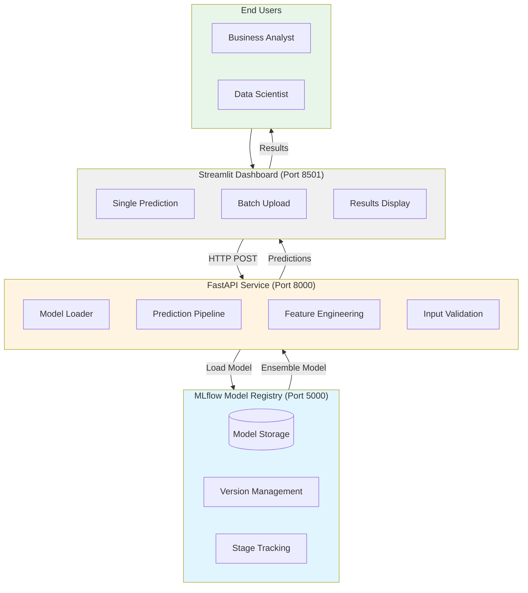
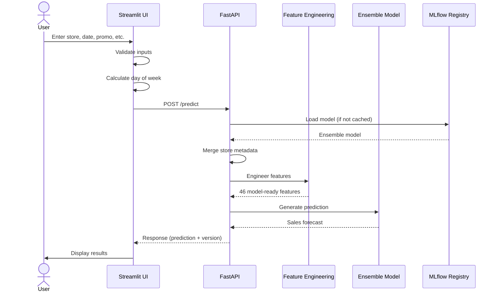
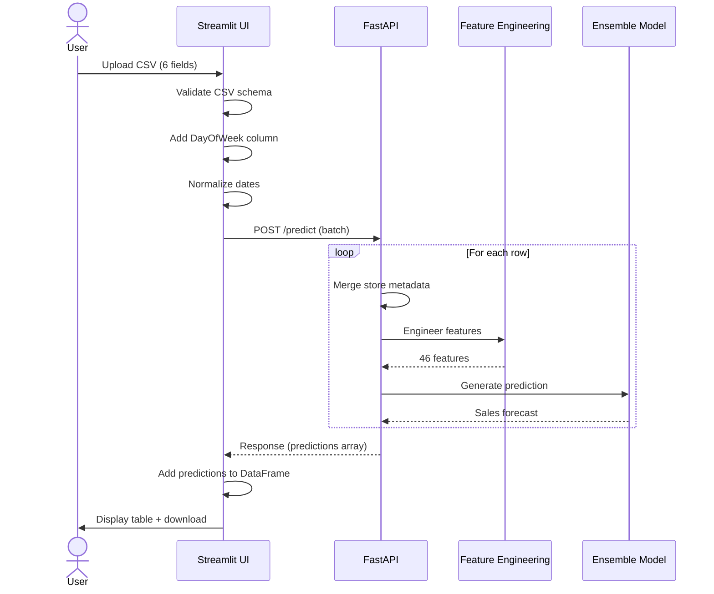

# Deployment Overview

## What is This Deployment?

This project implements a **production-ready ML deployment architecture** that mimics real-world industry patterns. The deployment consists of three integrated services:

1. **MLflow Model Registry** - Centralized model storage and versioning
1. **FastAPI Prediction Service** - REST API for serving model predictions
1. **Streamlit Dashboard** - User-friendly web interface for business users

This architecture demonstrates how trained ML models transition from experimentation to production serving, following industry best practices for model deployment and inference.

## Why This Architecture?

### Industry-Standard Pattern

Modern ML deployments separate concerns across three layers:

- **Model Registry Layer:** Centralized storage of trained models with versioning and lifecycle management
- **API Layer:** Scalable prediction service that loads models from registry and serves inference requests
- **UI Layer:** Business-facing interface that abstracts technical complexity

This separation enables:

- **Independent scaling:** API can handle high throughput while UI serves fewer users
- **Model updates:** Deploy new models without changing UI or API code
- **Multiple interfaces:** Same API can serve web UI, mobile apps, batch jobs, etc.
- **Security:** API can enforce authentication, rate limiting, and input validation

### Learning Objectives

This deployment showcases:

- **Model serving patterns:** Loading registered models and handling prediction requests
- **API design:** RESTful endpoints with proper validation and error handling
- **Feature engineering consistency:** Ensuring training and inference use identical transformations
- **User experience:** Making ML predictions accessible to non-technical stakeholders
- **Service orchestration:** Managing dependencies between multiple services

## Architecture Overview



## Service Responsibilities

### MLflow Model Registry (Port 5000)

**Purpose:** Centralized model artifact storage and version control

**Key Functions:**

- Stores trained ensemble models (LightGBM + XGBoost + CatBoost)
- Manages model versions (1, 2, 3, ...)
- Tracks model stages (Production, Staging, Archived)
- Provides API for model retrieval by stage or version
- Maintains model lineage and metadata

**In Production:** Would be a dedicated MLflow Tracking Server with database backend and cloud artifact storage (S3, Azure Blob, etc.)

**In This Project:** Runs locally with file-based storage (`./mlruns`, `./mlartifacts`)

### FastAPI Prediction Service (Port 8000)

**Purpose:** Serve model predictions via REST API

**Key Functions:**

- Loads production ensemble model from MLflow on startup
- Accepts prediction requests in simple train.csv format (7 fields)
- Automatically merges store metadata from `store.csv`
- Applies complete feature engineering pipeline (46 features)
- Returns predictions with model version information
- Supports both single and batch predictions

**In Production:** Would run behind load balancer with autoscaling, monitoring, and logging

**In This Project:** Runs as single process with Uvicorn ASGI server

### Streamlit Dashboard (Port 8501)

**Purpose:** User-friendly interface for business users

**Key Functions:**

- **Single Prediction:** Interactive form for one store/date forecast
- **Batch Upload:** CSV file upload for multiple predictions
- **Auto-calculation:** Day of week derived from date
- **Flexible dates:** Accepts multiple date formats (YYYY-MM-DD, MM/DD/YY, etc.)
- **Results download:** Export predictions to CSV
- **Store summaries:** Aggregate statistics by store

**In Production:** Would be protected behind authentication/authorization

**In This Project:** Open access for demonstration purposes

## Data Flow

### Single Prediction Request



### Batch Prediction Request



## Quick Start

!!! warning "Prerequisites Required"
    **You must have a registered model before using the deployment services.**

    The FastAPI service loads the Production model from MLflow on startup. If no model is registered, the service will fail to start.

    **First-time setup:**

    1. Complete the [DataOps workflow](../dataops/overview.md) to prepare your data
    1. Complete the [ModelOps workflow](../modelops/overview.md) to train and register a model
    1. Ensure at least one model is promoted to **Production** stage

    **Verify you have a Production model:**

    ```bash
    # Option 1: Check via Python
    python -c "from mlflow import MlflowClient; \
    client = MlflowClient(); \
    models = client.search_registered_models(); \
    print('Registered models:', [m.name for m in models])"

    # Option 2: Start MLflow UI and check manually
    bash scripts/start_mlflow.sh
    # Visit http://localhost:5000 → Models tab
    ```

    If you don't have a Production model, see the [ModelOps Training Guide](../modelops/training.md) to train and register your first model.

### Launch All Services

Use the unified launcher script to start all three services in the correct order:

```bash
bash scripts/launch_dashboard.sh
```

This will:

1. Start MLflow tracking server (port 5000)
1. Start FastAPI backend (port 8000, waits for MLflow)
1. Launch Streamlit dashboard (port 8501, waits for API)

**Services:**

- MLflow UI: http://localhost:5000
- FastAPI Docs: http://localhost:8000/docs
- Streamlit App: http://localhost:8501

### Manual Launch (Alternative)

Start each service individually if you need more control:

```bash
# Terminal 1: MLflow
bash scripts/start_mlflow.sh

# Terminal 2: FastAPI
cd deployment/api
python main.py

# Terminal 3: Streamlit
cd deployment/streamlit
streamlit run Home.py
```

### Stop Services

When you stop Streamlit (Ctrl+C), MLflow and FastAPI continue running in the background. To stop them:

```bash
# Stop MLflow
lsof -ti:5000 | xargs kill -9

# Stop FastAPI
lsof -ti:8000 | xargs kill -9
```

## Key Design Principles

### 1. Consistency Between Training and Inference

The same feature engineering code is used in both training and prediction:

- **Training:** `src/features/build_features.py` processes data for model training
- **Inference:** `src/data/prepare_predictions.py` uses identical feature functions
- **Result:** Predictions use exactly the same transformations as training data

### 2. Simplified User Input

Users only provide **7 basic fields** (train.csv format):

- Store, DayOfWeek, Date, Open, Promo, StateHoliday, SchoolHoliday

The API automatically handles:

- Merging store metadata (type, assortment, competition distance)
- Engineering 46 features (lags, rolling averages, calendar features)
- Converting data types and formatting

### 3. Model Versioning

Every prediction includes the model version used:

```json
{
  "predictions": [5234.56],
  "model_version": 3,
  "model_stage": "Production",
  "count": 1
}
```

This enables:

- **Reproducibility:** Know exactly which model produced each prediction
- **A/B testing:** Compare predictions from different model versions
- **Rollback:** Quickly identify if new model performs worse

### 4. Graceful Error Handling

The API validates inputs and returns clear error messages:

- Invalid store IDs (must be 1-1115)
- Invalid dates or formats
- Missing required fields
- Out-of-range values

Users get actionable feedback instead of stack traces.

## Documentation Structure

- **Overview** (this page) - Architecture and high-level flow
- **[FastAPI Service](fastapi.md)** - API endpoints, model loading, feature engineering
- **[Streamlit Dashboard](streamlit.md)** - UI features, single/batch predictions
- **[Launcher Script](launcher.md)** - Automated service orchestration

## Next Steps

- Explore the individual deployment documentation pages linked above
- Try making predictions through the Streamlit UI
- Experiment with the FastAPI endpoints at http://localhost:8000/docs
- See [ModelOps Documentation](../modelops/overview.md) for model training and registry
