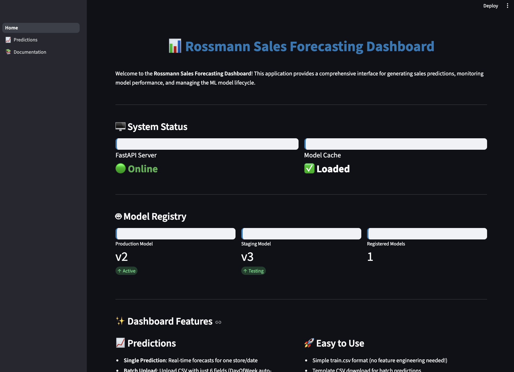
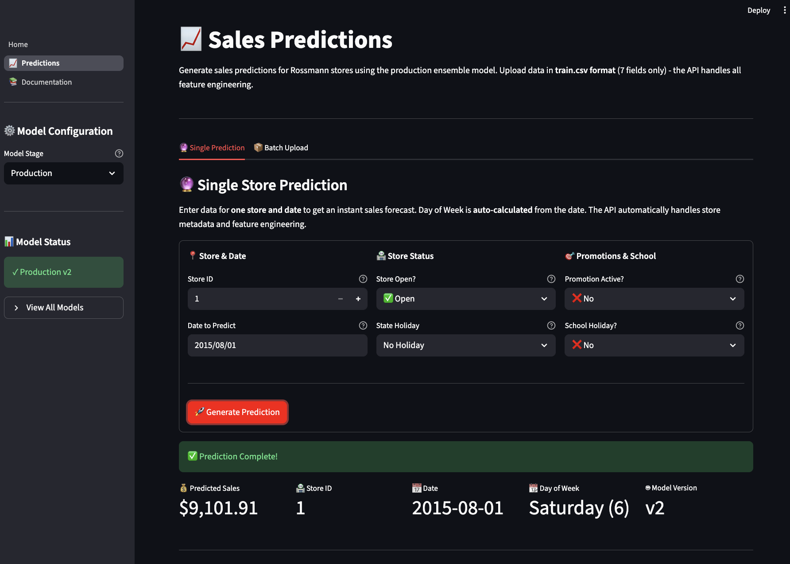
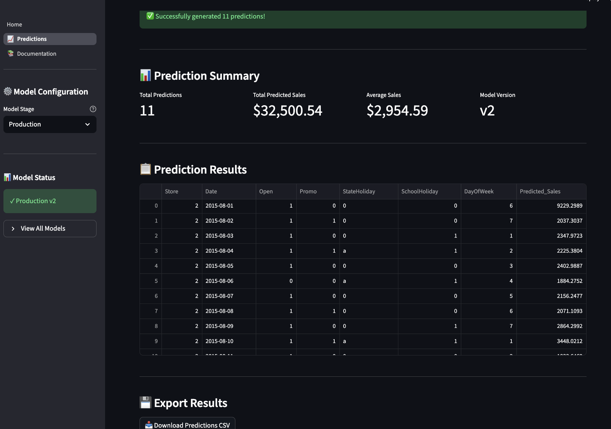

# Streamlit Dashboard

The Streamlit dashboard provides a user-friendly web interface for business users to generate sales predictions without writing code or using API endpoints. It acts as the front-end layer that consumes the FastAPI prediction service, abstracting away technical complexity.

**Location:** `deployment/streamlit/`

**Port:** 8501

**Framework:** Streamlit (multi-page app)

## Why a User Interface?

While the FastAPI service provides powerful prediction capabilities through a REST API, it requires technical knowledge to use effectively (crafting HTTP requests, handling JSON, etc.). A user interface solves this problem by:

### Accessibility

- **No coding required**: Business analysts and store managers can generate predictions through forms and file uploads
- **Self-service analytics**: Users can run predictions on-demand without waiting for data science team
- **Lower barrier to entry**: Anyone who can use Excel can use the dashboard

### User Experience

- **Visual feedback**: Real-time status indicators show API connection, model availability, and prediction results
- **Error prevention**: Client-side validation catches issues before making API calls, providing immediate feedback
- **Guided workflows**: Clear forms, help text, and examples walk users through the prediction process

### Productivity

- **Batch operations**: Upload CSV files to get hundreds of predictions in seconds
- **Quick iteration**: Modify inputs and re-run predictions without restarting processes
- **Downloadable results**: Export predictions to CSV for further analysis in Excel or BI tools

### Business Value

- **Faster decision-making**: Store managers can forecast sales for promotion planning without technical dependencies
- **Data democratization**: Predictions accessible to non-technical stakeholders across the organization
- **Adoption**: Visual interfaces drive higher ML model adoption than APIs alone

## Dashboard Overview

The application uses Streamlit's multi-page architecture with three main sections:

### 1. Home Page (Landing)

**Purpose:** System status dashboard and quick start guide



**Key Features:**

- **System Health Monitor**

    - FastAPI server status (Online/Offline indicator)
    - Model cache status (Loaded/Not Loaded)
    - Real-time connection testing

- **Model Registry Dashboard**

    - Production model version
    - Staging model version
    - Count of registered models

- **Feature Overview**

    - Highlights of prediction capabilities
    - Supported input formats
    - Links to documentation

- **Quick Start Instructions**

    - Step-by-step guide for first-time users
    - API server startup commands
    - Navigation tips

**When to use:** First stop for new users; check system status before making predictions

### 2. Predictions Page

**Purpose:** Generate sales forecasts through two prediction modes

#### Mode 1: Single Prediction

**Use case:** Quick forecast for one store on one date



**Features:**

- **Smart input form** with three columns:

    - Store details: Store ID (1-1115)
    - Date selection: Calendar picker (Day of Week auto-calculated!)
    - Store conditions: Open, Promo, StateHoliday, SchoolHoliday toggles

- **Real-time validation**

    - Store ID range checking
    - Date format validation
    - Required field enforcement

- **Instant results**

    - Predicted sales value
    - Model version used
    - Confidence indicators

**Example workflow:**

1. Select Store ID from dropdown (e.g., Store 25)
1. Pick date from calendar (DayOfWeek calculated automatically)
1. Toggle switches for Open (Yes), Promo (Yes), Holidays (No)
1. Click "Generate Prediction"
1. See forecast: "Predicted Sales: €5,234.56"

#### Mode 2: Batch Upload

**Use case:** Forecast for multiple stores/dates at once



**Features:**

- **CSV template download**

    - Pre-formatted template with correct column names
    - Example rows showing proper format
    - Only 6 fields required (DayOfWeek auto-calculated)

- **Flexible date parsing**

    - Supports multiple formats: YYYY-MM-DD, MM/DD/YY, MM/DD/YYYY
    - Automatic normalization to API format

- **File upload validation**

    - Schema checking (required columns present)
    - Data type validation (Store as integer, Date as valid format)
    - Range validation (Store 1-1115, valid dates)

- **Batch processing**

    - Sends all rows to API in single request
    - Progress indicator during processing
    - Handles 100s of predictions efficiently

- **Enhanced results table**

    - Original input columns preserved
    - Prediction column appended
    - Sortable and filterable
    - Download as CSV

- **Store-level analytics**

    - Average predicted sales by store
    - Min/max predictions
    - Prediction distribution charts

**Example workflow:**

1. Click "Download CSV Template"
1. Open template in Excel
1. Fill in Store, Date, Open, Promo, StateHoliday, SchoolHoliday (6 columns)
1. Save as CSV
1. Upload to dashboard
1. Review predictions table
1. Download results with predictions added

**CSV Template Format:**

```csv
Store,Date,Open,Promo,StateHoliday,SchoolHoliday
1,2015-08-01,1,1,0,0
2,2015-08-02,1,0,0,0
3,2015-08-03,0,0,a,1
```

**After prediction:**

```csv
Store,Date,Open,Promo,StateHoliday,SchoolHoliday,DayOfWeek,Predicted_Sales
1,2015-08-01,1,1,0,0,6,5234.56
2,2015-08-02,1,0,0,0,7,4821.33
3,2015-08-03,0,0,a,1,1,0.00
```

### 3. Documentation Page

**Purpose:** API reference and integration examples

**Content:**

- **API Endpoints**: Interactive examples of /predict, /health, /model/info
- **Request/Response Formats**: JSON schemas with real examples
- **curl Commands**: Copy-paste ready commands for testing
- **Python Integration**: Code snippets using requests library
- **Error Handling**: Common errors and troubleshooting

**When to use:** Developers integrating predictions into other systems

## Key Design Features

### Automatic Day of Week Calculation

**Problem:** train.csv format requires DayOfWeek (1-7), but users think in dates

**Solution:** Dashboard calculates DayOfWeek from Date automatically

- Single prediction: Hidden from user entirely
- Batch upload: Calculated during CSV processing
- Users only need to provide Date field

### Client-Side Validation

**Why:** Prevent unnecessary API calls for invalid data

**What's validated:**

- **Store ID**: Must be integer between 1 and 1115
- **Date**: Must be valid date in supported format
- **Open**: Must be 0 or 1
- **Promo**: Must be 0 or 1
- **StateHoliday**: Must be one of: 0, a, b, c
- **SchoolHoliday**: Must be 0 or 1

**User experience:**

- Immediate feedback as user types
- Red error messages with actionable instructions
- Form submission disabled until all fields valid

### Model Stage Selection

**Feature:** Dropdown to choose Production vs Staging model

**Use cases:**

- **Production**: Default for business predictions
- **Staging**: A/B testing new model before promotion

**Implementation:**

- Sidebar dropdown persists across tabs
- Model version shown in sidebar
- Stage passed to API with each request

### Error Handling

**API Offline:**

```
⚠️ FastAPI server is not running. The Predictions page requires the API server to be active.

To start the API server:
cd deployment/api && python main.py

The API will be available at http://localhost:8000
```

**No Model Available:**

```
❌ No Production model available

You need to:
1. Train and register a model in MLflow
2. Promote model to Production stage
3. Restart FastAPI to load the model
```

**Invalid Input:**

```
❌ Validation Error
- Store ID must be between 1 and 1115 (got: 9999)
- Date must be in YYYY-MM-DD format (got: "08/01/15")
```

## Running the Dashboard

### Quick Start (Recommended)

Use the automated launch script:

```bash
bash scripts/launch_streamlit.sh
```

**What it does:**

- Activates virtual environment
- Checks for Streamlit dependency
- Navigates to streamlit directory
- Starts app with proper configuration
- Opens browser automatically

### Manual Start

If you prefer direct control:

```bash
cd deployment/streamlit
streamlit run Home.py
```

**Access the dashboard:**

- **URL**: http://localhost:8501
- **Auto-opens**: Browser launches automatically
- **Hot reload**: Changes to .py files reload app instantly

### Production Deployment

For production deployment with authentication:

```bash
# Using Docker
docker build -t rossmann-streamlit -f deployment/streamlit/Dockerfile .
docker run -p 8501:8501 rossmann-streamlit

# Using systemd service
sudo cp deployment/streamlit/streamlit.service /etc/systemd/system/
sudo systemctl enable streamlit
sudo systemctl start streamlit
```

## Technical Architecture

### Multi-Page Structure

```
deployment/streamlit/
├── Home.py                    # Landing page (system status)
├── pages/
│   ├── 1_📈_Predictions.py    # Prediction interface
│   └── 2_📚_Documentation.py  # API reference
└── utils/
    ├── api_client.py          # FastAPI communication
    └── validation.py          # Input validation logic
```

**How it works:**

- `Home.py` is the entry point (landing page)
- Files in `pages/` become navigation items automatically
- Number prefix controls page order (1\_, 2\_, etc.)
- Emoji in filename becomes page icon in sidebar

### API Client (`utils/api_client.py`)

**Purpose:** Abstraction layer for FastAPI communication

**Key methods:**

```python
class APIClient:
    def health_check() -> dict
    def get_model_info() -> dict
    def predict(inputs: list, model_stage: str) -> dict
```

**Benefits:**

- Centralized error handling
- Automatic retries on connection errors
- Consistent request formatting
- Timeout management

### Validation Module (`utils/validation.py`)

**Purpose:** Client-side data validation before API calls

**Key functions:**

```python
def validate_single_prediction_input(data: dict) -> tuple[bool, str]
def validate_batch_csv(df: pd.DataFrame) -> tuple[bool, str]
def process_batch_csv(file) -> pd.DataFrame
def get_csv_template() -> pd.DataFrame
```

**Benefits:**

- Reduces invalid API calls
- Provides immediate user feedback
- Standardizes date formats
- Generates downloadable templates

## Next Steps

- See [FastAPI Service](fastapi.md) for API that powers this dashboard
- See [Launcher Script](launcher.md) for unified startup of all services
- See [Deployment Overview](overview.md) for complete architecture
- Try the dashboard at http://localhost:8501 after running `bash scripts/launch_streamlit.sh`
