# MLOps Workflow Overview

This guide illustrates the complete MLOps workflow from data processing to model deployment, showing how different stages connect together.

______________________________________________________________________

## Complete MLOps Pipeline

```mermaid
flowchart TB
    Start[📥 Raw Data]

    subgraph Phase1["🔧 DataOps Phase"]
        direction TB
        V1[🔍 Validate Raw Data]
        P1[🔄 Process & Clean]
        V2[🔍 Validate Processed]
        F1[🎯 Engineer Features]
        V3[🔍 Validate Features]
        DVC1[💾 Version with DVC]
        V1 --> P1 --> V2 --> F1 --> V3 --> DVC1
    end

    subgraph Phase2["🤖 ModelOps Phase"]
        direction TB
        E1[📊 Experiment & Train]
        E2[📈 Track with MLflow]
        E3[🔬 Evaluate Models]
        R1[📝 Register Best Model]
        E1 --> E2 --> E3 --> R1
    end

    subgraph Phase3["🚀 Deployment Phase"]
        direction TB
        D1[🐳 Build Containers]
        D2[🌐 Deploy API]
        D3[📊 Deploy Dashboard]
        D1 --> D2
        D1 --> D3
    end

    subgraph Phase4["📈 Monitoring Phase"]
        direction TB
        M1[📉 Track Performance]
        M2[🔍 Detect Drift]
        M3[🔔 Alert on Issues]
        M1 --> M2 --> M3
    end

    Start --> Phase1
    Phase1 --> Phase2
    Phase2 --> Phase3
    Phase3 --> Phase4
    Phase4 -.retrain trigger.-> Phase1

    style Phase1 fill:#e8f5e9
    style Phase2 fill:#e3f2fd
    style Phase3 fill:#fff3e0
    style Phase4 fill:#fce4ec
```



______________________________________________________________________

## Phase 1: DataOps

**Goal:** Transform raw data into validated, versioned features ready for modeling.

### Commands

```bash
# Complete DataOps pipeline (automated)
bash scripts/dataops_workflow.sh
```

**Or run individual steps:**

```bash
# Step 1: Validate raw data
python src/data/validate_data.py --stage raw --fail-on-error

# Step 2: Process and clean data
python -m src.data.make_dataset

# Step 3: Validate processed data
python src/data/validate_data.py --stage processed --fail-on-error

# Step 4: Engineer features
python -m src.features.build_features

# Step 5: Validate features
python src/data/validate_data.py --stage features --fail-on-error

# Step 6: Version with DVC
dvc add data/processed/train_clean.parquet
dvc add data/processed/train_features.parquet
git add data/processed/*.dvc .gitignore
git commit -m "data: version processed data and features"
```

### Outputs

- `data/processed/train_clean.parquet` - Cleaned and merged data
- `data/processed/train_features.parquet` - Feature-engineered dataset
- `data/processed/*.dvc` - DVC metadata files

**Learn more:** [DataOps Workflow Guide](../dataops/overview.md)

______________________________________________________________________

## Phase 2: ModelOps

**Goal:** Train, evaluate, and register production-ready models.

### Commands

```bash
# Option A: Jupyter Notebooks (exploration)
jupyter lab
# Navigate to: notebooks/03-baseline-models.ipynb
#              notebooks/04-advanced-models-and-ensembles.ipynb

# Option B: Python Scripts (production)
python -m src.models.train_baselines
python -m src.models.train_advanced
python -m src.models.ensembles

# View experiments in MLflow
mlflow ui
# Open: http://localhost:5000
```

### Workflow Details


### Outputs

- MLflow experiments with metrics, parameters, and artifacts
- Trained model files in `models/`
- Registered production model in MLflow Model Registry
- Performance metrics in `outputs/metrics/`

**Learn more:** [Model Training Guide](../modelops/training.md)

______________________________________________________________________

## Phase 3: Deployment

**Goal:** Deploy models via API and interactive dashboard.

### Commands

```bash
# Deploy all services with Docker Compose
docker-compose up --build

# Or deploy individually:

# FastAPI prediction service
docker build -t rossmann-api -f Dockerfile .
docker run -p 8000:8000 rossmann-api

# Streamlit dashboard
docker build -t rossmann-dashboard -f Dockerfile.streamlit .
docker run -p 8501:8501 rossmann-dashboard

# MLflow tracking server
mlflow server --host 0.0.0.0 --port 5000
```

### Access Services

- **API**: http://localhost:8000
- **API Docs**: http://localhost:8000/docs
- **Dashboard**: http://localhost:8501
- **MLflow**: http://localhost:5000

### Deployment Architecture

```mermaid
flowchart TB
    User[👤 User] --> LB[Load Balancer]

    LB --> API1[FastAPI Instance 1]
    LB --> API2[FastAPI Instance 2]

    API1 --> ML[MLflow Registry]
    API2 --> ML

    ML --> Model[Production Model]

    API1 --> Logger[Prediction Logger]
    API2 --> Logger

    Logger --> Monitor[Monitoring Service]

    Dashboard[📊 Streamlit Dashboard] --> ML

    style Model fill:#81c784
    style Monitor fill:#ffd54f
```



**Learn more:** Deployment guide coming soon

______________________________________________________________________

## Phase 4: Monitoring

**Goal:** Track model performance and detect data drift in production.

### Commands

```bash
# Generate drift report
python -m src.monitoring.drift_detection \
    --reference data/processed/train_features.parquet \
    --current data/production/current_batch.parquet \
    --output monitoring/drift_reports/

# Track model performance
python -m src.monitoring.performance \
    --predictions outputs/predictions/production.csv \
    --actuals data/production/actuals.csv \
    --output monitoring/performance_reports/

# View reports
open monitoring/drift_reports/latest_drift_report.html
```

### Monitoring Dashboard

```mermaid
flowchart LR
    subgraph Metrics["📊 Key Metrics"]
        M1[RMSPE]
        M2[Prediction Latency]
        M3[Request Volume]
    end

    subgraph Drift["🔍 Drift Detection"]
        D1[Feature Drift]
        D2[Target Drift]
        D3[Concept Drift]
    end

    subgraph Alerts["🔔 Alerting"]
        A1[Performance Degradation]
        A2[Data Quality Issues]
        A3[System Errors]
    end

    Metrics --> Alerts
    Drift --> Alerts
    Alerts --> Action[🔄 Trigger Retraining]

    style Action fill:#ffcdd2
```



### Outputs

- Drift detection reports (HTML/JSON)
- Performance metrics over time
- Alerts for issues requiring attention

**Learn more:** Monitoring guide coming soon

______________________________________________________________________

## End-to-End Example

Here's a complete workflow from scratch:

### 1. Initial Setup (5 minutes)

```bash
# Clone and install
git clone https://github.com/bradleyboehmke/rossmann-forecasting.git
cd rossmann-forecasting
pip install uv
uv venv && source .venv/bin/activate
uv pip install -e .
```

### 2. DataOps (10 minutes)

```bash
# Run complete data pipeline
bash scripts/dataops_workflow.sh

# Result: Validated features ready for modeling
```

### 3. ModelOps (30 minutes)

```bash
# Train models with MLflow tracking
python -m src.models.train_baselines
python -m src.models.train_advanced

# View experiments
mlflow ui

# Register best model (via MLflow UI or programmatically)
```

### 4. Deployment (5 minutes)

```bash
# Deploy all services
docker-compose up --build

# Test API
curl -X POST http://localhost:8000/predict \
  -H "Content-Type: application/json" \
  -d '{"store": 1, "date": "2015-08-01", ...}'
```

### 5. Monitoring (Ongoing)

```bash
# Generate monitoring reports
python -m src.monitoring.drift_detection
python -m src.monitoring.performance

# Review dashboards and alerts
```

______________________________________________________________________

## Continuous Improvement Loop

```mermaid
flowchart LR
    P[📊 Monitor Production] --> D{Drift or<br/>Degradation?}
    D -->|Yes| R[🔄 Retrain]
    D -->|No| P
    R --> DataOps[🔧 DataOps:<br/>New Data]
    DataOps --> ModelOps[🤖 ModelOps:<br/>Retrain]
    ModelOps --> E[📈 Evaluate]
    E --> Better{Better than<br/>Current?}
    Better -->|Yes| Deploy[🚀 Deploy New Model]
    Better -->|No| Keep[Keep Current Model]
    Deploy --> P
    Keep --> P

    style R fill:#ffcdd2
    style Deploy fill:#c8e6c9
```



**The workflow is continuous:**

1. **Monitor** production performance and data quality
1. **Detect** when model performance degrades or data drifts
1. **Retrain** using fresh data through the DataOps pipeline
1. **Evaluate** if the new model outperforms the current one
1. **Deploy** only if the new model is better
1. **Repeat** continuously to maintain model performance

______________________________________________________________________

## Quick Reference

### Common Commands

| Task                        | Command                                    |
| --------------------------- | ------------------------------------------ |
| **Run DataOps pipeline**    | `bash scripts/dataops_workflow.sh`         |
| **Train baseline models**   | `python -m src.models.train_baselines`     |
| **Train advanced models**   | `python -m src.models.train_advanced`      |
| **View MLflow experiments** | `mlflow ui` (http://localhost:5000)        |
| **Deploy all services**     | `docker-compose up --build`                |
| **Generate drift report**   | `python -m src.monitoring.drift_detection` |
| **Run tests**               | `pytest tests/ -v`                         |
| **View documentation**      | `mkdocs serve` (http://localhost:8000)     |

### Key Directories

- `data/raw/` - Original immutable data
- `data/processed/` - Cleaned data and features
- `models/` - Trained model artifacts
- `mlruns/` - MLflow experiment tracking
- `monitoring/` - Drift and performance reports
- `outputs/` - Predictions and metrics

______________________________________________________________________

## Next Steps

Now that you understand the complete workflow:

- **[Quick Start](quickstart.md)** - Get up and running in 5 minutes
- **[DataOps Workflow](../dataops/overview.md)** - Deep dive into data processing
- **[Model Training](../modelops/overview.md)** - Learn experiment tracking
- **Deployment** - Deploy to production (Coming Soon)
- **Monitoring** - Track performance (Coming Soon)
