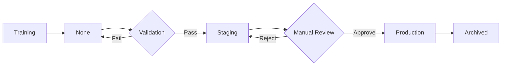

# ModelOps Overview

## What is ModelOps?

ModelOps (Model Operations) is the practice of managing the complete machine learning model lifecycle, from experimentation to production deployment and monitoring. This project implements ModelOps using MLflow for tracking, versioning, and deployment.

## Key Components

### 1. Experimentation

Jupyter notebooks for model development with MLflow tracking:

- Baseline models for benchmarking
- Hyperparameter tuning with Optuna
- Ensemble model development
- Performance evaluation

### 2. Model Registry

MLflow Model Registry for versioning and lifecycle management:

- Automated model registration
- Stage-based promotion (None → Staging → Production)
- Version tracking and lineage
- Model metadata and artifacts

### 3. Production Code

Production-ready modules in `src/models/`:

- `ensemble.py` - Custom PyFunc ensemble wrapper
- `model_registry.py` - Registry management utilities
- `train_ensemble.py` - Automated training pipeline
- `validate_model.py` - Validation and promotion
- `predict.py` - Production inference

### 4. Automated Retraining

Orchestrated workflow for model updates:

- Data validation
- Model training with best hyperparameters
- Automated validation and promotion
- Inference testing

## Quick Start

### Launch MLflow UI

```bash
mlflow ui
```

Open browser to http://localhost:5000

### Train Model

```bash
python src/models/train_ensemble.py
```

### Validate and Promote

```bash
python src/models/validate_model.py
```

### Run Inference

```bash
python src/models/predict.py --stage Production
```

### Automated Retraining

```bash
bash scripts/retrain_pipeline.sh
```

## Model Lifecycle



## Documentation Structure

- **Overview** (this page) - Quick introduction to ModelOps
- **[Experiment Tracking](tracking.md)** - MLflow tracking guide
- **[Model Training](training.md)** - Production training pipeline
- **[Model Registry](registry.md)** - Model versioning and lifecycle
- **[Hyperparameter Tuning](tuning.md)** - Optuna optimization guide

## Next Steps

- Explore the individual ModelOps documentation pages linked above
- Explore individual components in the navigation menu
- See [DataOps Documentation](../dataops/overview.md) for data pipeline information
