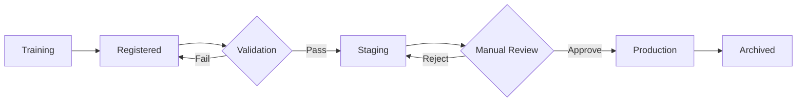

# ModelOps Overview

## What is ModelOps?

ModelOps (Model Operations) is the practice of managing the complete machine learning model lifecycle, from experimentation to production deployment and monitoring. This project implements ModelOps using MLflow for tracking, versioning, and deployment.

## Key Components

### 1. Experimentation (Notebooks)

**Purpose:** Explore different models and find optimal hyperparameters

The project uses Jupyter notebooks (`notebooks/03-baseline-models.ipynb` and `notebooks/04-advanced-models-and-ensembles.ipynb`) for interactive model experimentation:

- **Baseline models:** Simple models (naive, basic LightGBM) to establish performance benchmarks
- **Hyperparameter tuning:** Optuna trials across LightGBM, XGBoost, and CatBoost to find best parameters
- **Ensemble development:** Weighted combination of top models for improved performance
- **MLflow tracking:** All experiments automatically logged with hyperparameters, metrics (RMSPE), and artifacts

**Output:** Best hyperparameters saved to `config/best_hyperparameters.json` for production use

### 2. Model Registry (MLflow)

**Purpose:** Centralized model versioning and lifecycle management

After training, models are registered in MLflow Model Registry with automated stage-based promotion:

- **Registration:** Trained ensemble models automatically registered with version numbers
- **Staging validation:** New models promoted to "Staging" after passing RMSPE threshold (\< 0.10)
- **Production promotion:** Manual approval moves "Staging" → "Production" (human-in-the-loop safety)
- **Archival:** Previous "Production" models automatically archived when new version promoted
- **Lineage tracking:** Each model version linked to data version (DVC) and training parameters

**Stages:** None (newly registered) → Staging (validated) → Production (approved) → Archived (replaced)

### 3. Production Code (`src/models/`)

**Purpose:** Reproducible, automated model training and deployment

Production-ready Python modules that use best hyperparameters from experimentation:

- **`train_ensemble.py`:** Automated training pipeline using `config/best_hyperparameters.json`
    - Loads most recently processed features from `data/processed/train_features.parquet`
    - Trains LightGBM, XGBoost, CatBoost with optimal hyperparameters
    - Creates weighted ensemble (30% LightGBM, 60% XGBoost, 10% CatBoost)
    - Registers model to MLflow Registry
- **`validate_model.py`:** Automated validation and promotion
    - Loads latest model from Registry
    - Validates performance on holdout data
    - Auto-promotes to "Staging" if RMSPE \< threshold
- **`predict.py`:** Production inference pipeline
    - Loads model from Registry by stage (Staging/Production)
    - Generates predictions for new data
    - Logs predictions for monitoring
- **`ensemble.py`:** Custom MLflow PyFunc wrapper for ensemble deployment
- **`model_registry.py`:** Utility functions for Registry operations (load, promote, version info)

### 4. Automated Retraining (`scripts/retrain_pipeline.sh`)

**Purpose:** Scheduled model updates as new data arrives

End-to-end orchestrated workflow for production retraining:

1. **Data validation:** Validate new raw data with Great Expectations
1. **Feature engineering:** Process new data through feature pipeline
1. **Model training:** Train ensemble using `train_ensemble.py` with best hyperparameters
1. **Automated validation:** Run `validate_model.py` to check performance and promote to Staging
1. **Manual review:** Human reviews Staging model in MLflow UI before Production promotion
1. **Inference testing:** Test Production model on sample data to ensure it works

**Trigger:** Can be scheduled (cron, Airflow) or run manually when new data arrives

## Quick Start

### Launch MLflow UI

```bash
mlflow ui
```

Open browser to http://localhost:5000 to view experiments and model registry

### Option A: Experiment and Tune (Full Workflow)

**Use this approach to:**

- Explore different model architectures
- Run your own hyperparameter tuning trials
- Generate custom `best_hyperparameters.json` based on your data

```bash
# 1. Run experimentation notebooks in order
jupyter lab

# Open and execute:
# - notebooks/03-baseline-models.ipynb (benchmarks)
# - notebooks/04-advanced-models-and-ensembles.ipynb (Optuna tuning)
# - notebooks/05-final-eval-and-test-simulation.ipynb (save best params & register final model)
```

**Output:** Best hyperparameters saved to `config/best_hyperparameters.json`

**Then:** Proceed to "Train Production Model" below

### Option B: Use Pre-Tuned Model (Fast Path)

**Use this approach to:**

- Skip experimentation and use pre-tuned hyperparameters
- Quickly train production model with optimal settings
- Reproduce results from notebook experiments

The repository includes `config/best_hyperparameters.json` with hyperparameters already tuned via Optuna (100+ trials per model). This allows you to train the production model immediately without running notebooks.

### Train Production Model

```bash
# Uses hyperparameters from config/best_hyperparameters.json
python src/models/train_ensemble.py
```

### Validate and Promote

```bash
# Automatically promotes to "Staging" if RMSPE < 0.10
python src/models/validate_model.py
```

### Run Inference

```bash
# Load model from "Production" stage and generate predictions
python src/models/predict.py --stage Production
```

### Automated Retraining Pipeline

```bash
# Complete workflow: data validation → training → validation → inference test
bash scripts/retrain_pipeline.sh
```

## Model Lifecycle



**Stage Definitions:**

- **Registered:** Newly trained model registered in MLflow, awaiting validation
- **Staging:** Model passed automated validation (RMSPE \< 0.10), ready for manual review
- **Production:** Approved model actively serving predictions
- **Archived:** Previous production model, replaced by newer version

## Documentation Structure

- **Overview** (this page) - Quick introduction to ModelOps
- **[Experiment Tracking](tracking.md)** - MLflow tracking guide
- **[Model Training](training.md)** - Production training pipeline
- **[Model Registry](registry.md)** - Model versioning and lifecycle
- **[Hyperparameter Tuning](tuning.md)** - Optuna optimization guide

## Next Steps

- Explore the individual ModelOps documentation pages linked above
- Explore individual components in the navigation menu
- See [DataOps Documentation](../dataops/overview.md) for data pipeline information
