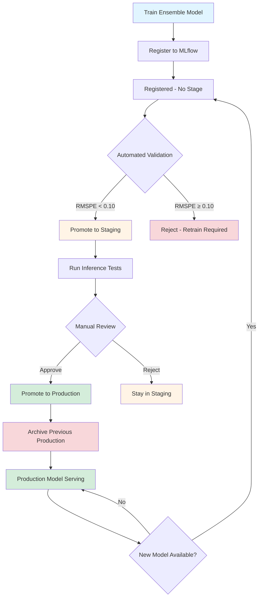
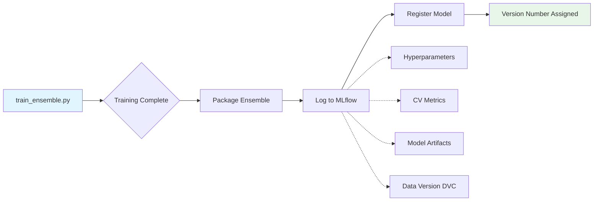
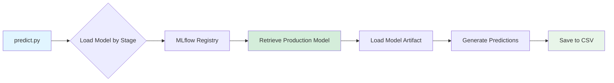

# Model Registry

## Why Model Versioning Matters

After training a production model, the next challenge is managing its lifecycle: validating performance, controlling deployment, tracking lineage, and safely rolling back if issues arise. Without proper versioning and stage management, teams face:

- **Deployment chaos**: Uncertainty about which model version is in production
- **Risky updates**: No safety net when deploying new models
- **Lost lineage**: Inability to trace models back to training data and hyperparameters
- **Difficult rollbacks**: No clear path to revert to previous working versions

**MLflow Model Registry solves these problems** by providing centralized version control with stage-based lifecycle management, automated validation gates, and complete lineage tracking.

## Model Lifecycle in This Project

This project implements a **staged promotion workflow** with automated validation and manual approval gates:



### Stage Definitions

**None (Registered)**

- Newly trained model just registered to MLflow
- No validation performed yet
- **Next step**: Automated validation via `validate_model.py`

**Staging**

- Model passed automated validation (RMSPE \< 0.10 threshold)
- Ready for manual testing and review
- **Testing**: Run inference on sample data, review predictions in MLflow UI
- **Next step**: Manual promotion to Production after approval

**Production**

- Approved model actively serving predictions
- Used by `predict.py` for all inference requests
- **Previous Production model**: Automatically archived when new model promoted

**Archived**

- Former Production model replaced by newer version
- Retained for rollback if needed
- **Still accessible**: Can be reloaded by version number

## Model Registration

When the production training pipeline completes, it automatically registers the ensemble model to MLflow Model Registry:



**What gets registered:**

- **Model artifact**: Serialized ensemble (LightGBM + XGBoost + CatBoost)
- **Dependencies**: Conda environment with exact library versions
- **Metadata**: Hyperparameters, ensemble weights, training metrics
- **Lineage**: Link to training run, data version (DVC hash)

**Example registration output:**

```bash
$ python src/models/train_ensemble.py

Training LightGBM... ✓
Training XGBoost... ✓
Training CatBoost... ✓
Creating ensemble... ✓
Registering model to MLflow Model Registry...
✓ Model registered: rossmann-ensemble version 7
```

## Automated Validation and Staging Promotion

After registration, the model must pass validation before moving to Staging:

```bash
# Validate latest registered model
python src/models/validate_model.py
```

**Validation process:**

1. **Load latest model** from registry (most recent version in "None" stage)
1. **Evaluate on holdout set**: Calculate RMSPE on validation data not seen during training
1. **Check threshold**: If RMSPE \< 0.10, proceed to promotion
1. **Promote to Staging**: Automatically transition model stage
1. **Log validation metrics**: Record validation RMSPE, timestamp, data version

**Example output:**

```bash
$ python src/models/validate_model.py

Loading model version 7...
Evaluating on holdout validation set...
Validation RMSPE: 0.0978
✓ Performance meets threshold (< 0.10)
Promoting to Staging...
✓ Model version 7 promoted to Staging
```

If validation fails (RMSPE ≥ 0.10), the model remains in "None" stage and requires retraining with improved features or hyperparameters.

## Manual Production Promotion

**Why manual promotion?** Production deployment requires human judgment beyond automated metrics:

- **Business context**: Does the model align with current business priorities?
- **Prediction quality**: Are predictions reasonable for edge cases?
- **Timing considerations**: Is this a good time to deploy (avoid high-traffic periods)?
- **Risk assessment**: What's the rollback plan if issues occur?

### Testing Staging Models

Before promoting to Production, run inference tests:

```bash
# Generate predictions using Staging model
python src/models/predict.py --stage Staging --output predictions_staging.csv

# Compare with current Production
python src/models/predict.py --stage Production --output predictions_production.csv

# Review predictions, check for anomalies
```

**Review checklist:**

- [ ] Staging model RMSPE is better than current Production
- [ ] Predictions look reasonable across different store types
- [ ] No obvious bias in predictions (underestimating/overestimating)
- [ ] Model performs well on recent data (not just historical validation)

### Promoting to Production

Once manual review is complete:

```bash
# Promote Staging model to Production
python src/models/validate_model.py --promote-to-production
```

**What happens during promotion:**

1. **Load Staging model**: Get latest model in Staging stage
1. **Archive current Production**: Move existing Production model to Archived stage
1. **Promote to Production**: Transition Staging model to Production stage
1. **Log promotion event**: Record timestamp, user, reason for promotion
1. **Confirmation**: Display new Production version

**Example output:**

```bash
$ python src/models/validate_model.py --promote-to-production

Loading Staging model (version 7)...
Archiving current Production model (version 5)...
Promoting version 7 to Production...
✓ Model version 7 is now in Production
✓ Previous Production model (version 5) archived
```

## Using Registered Models for Predictions

The production inference pipeline (`predict.py`) loads models directly from the Registry by stage:

```bash
# Use Production model (default)
python src/models/predict.py --stage Production

# Test with Staging model
python src/models/predict.py --stage Staging
```

**How it works:**



**Key benefits:**

- **No hardcoded paths**: Model loaded dynamically by stage name
- **Instant rollback**: Change stage to revert to previous version
- **Consistent interface**: Same prediction code across all model versions
- **Automatic version tracking**: MLflow logs which version generated each prediction

## Rollback Strategy

If a Production model exhibits issues, rollback to the previous Archived version:

**Option 1: Promote archived model back to Production**

```bash
# Find archived version number
mlflow ui  # Check Registry tab for Archived models

# Promote archived version back to Production
python src/models/validate_model.py --promote-to-production --version 5
```

**Option 2: Demote current Production, restore previous**

```bash
# Archive problematic Production model
# Promote previous Archived version to Production
python src/models/validate_model.py --promote-to-production --version 5
```

## Best Practices

1. **Always validate before Staging**: Never skip automated validation checks
1. **Test Staging thoroughly**: Run inference tests on diverse data samples before Production promotion
1. **Manual Production approval**: Require human review for Production deployments
1. **Document promotion reasons**: Add notes in MLflow UI explaining why model was promoted
1. **Monitor Production performance**: Track RMSPE on live predictions to detect drift
1. **Keep archived models**: Retain at least 2-3 previous Production versions for rollback
1. **Link to data versions**: Always log DVC commit hash to trace model lineage

## Next Steps

- **[Hyperparameter Tuning](tuning.md)**: Learn how to optimize models for better validation performance
- **[Experiment Tracking](tracking.md)**: Understand how training experiments link to registered models
- **[Model Training](training.md)**: Review the production training pipeline that creates registered models
