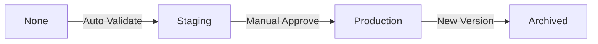

# Model Registry

## MLflow Model Registry

The Model Registry provides centralized model versioning and lifecycle management.

## Model Stages

Models progress through stages:



- **None**: Newly registered, not validated
- **Staging**: Passed validation, ready for testing
- **Production**: Active model serving predictions
- **Archived**: Previous production model

## Loading Models

### By Stage

```python
from models.model_registry import load_model

# Load production model
model = load_model("rossmann-ensemble", stage="Production")

# Load staging model
model = load_model("rossmann-ensemble", stage="Staging")

# Make predictions
predictions = model.predict(X_test)
```

### By Version

```python
# Load specific version
model = load_model("rossmann-ensemble", stage="3")
predictions = model.predict(X_test)
```

## Promoting Models

### To Staging (Automated)

```bash
# Validate and auto-promote to Staging
python src/models/validate_model.py
```

### To Production (Manual)

```bash
# Promote Staging to Production
python src/models/validate_model.py --promote-to-production

# Promote specific version
python src/models/validate_model.py --promote-to-production --version 3
```

### Programmatically

```python
from models.model_registry import promote_model

# Promote to Production
promote_model(
    model_name="rossmann-ensemble",
    version="3",
    stage="Production",
    archive_existing=True  # Archive current Production model
)
```

## Model Information

### Get Model Version

```python
from models.model_registry import get_model_version

# Get current Production version
version = get_model_version("rossmann-ensemble", stage="Production")
print(f"Production version: {version}")
```

### Get Model Details

```python
from models.model_registry import get_model_info

# Get info for specific version
info = get_model_info("rossmann-ensemble", version="3")
print(f"Stage: {info['current_stage']}")
print(f"Run ID: {info['run_id']}")

# Get all versions
all_info = get_model_info("rossmann-ensemble")
for version in all_info['versions']:
    print(f"Version {version['version']}: {version['stage']}")
```

## Registry Management

### List Models

```python
from models.model_registry import list_registered_models

models = list_registered_models()
for model_name in models:
    print(model_name)
```

### Archive Old Versions

Old Production models are automatically archived when a new model is promoted to Production (if `archive_existing=True`).

## Best Practices

1. **Always test Staging**: Run inference tests before Production promotion
1. **Manual Production promotion**: Human-in-the-loop for safety
1. **Keep Production stable**: Only promote well-tested models
1. **Document versions**: Add descriptions explaining changes
1. **Monitor lineage**: Track which data version was used
