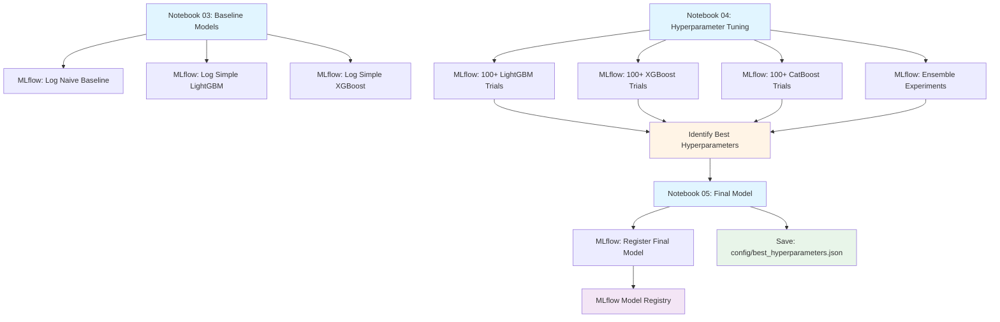
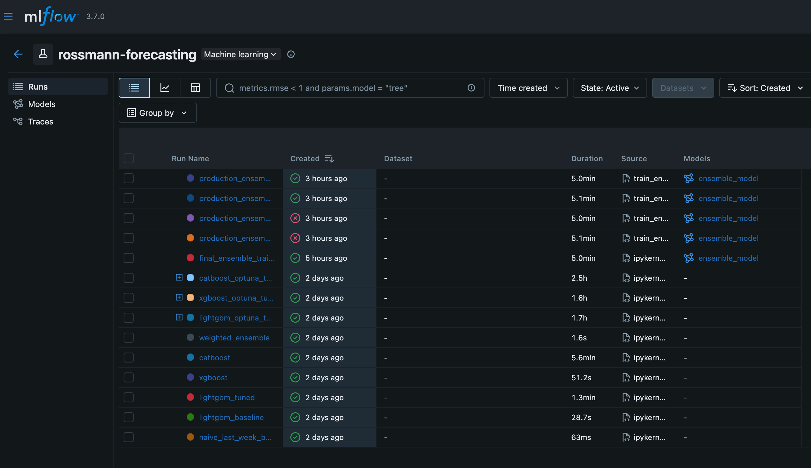

# Experiment Tracking

## Why Track Experiments?

When developing machine learning models, data scientists typically experiment with many different approaches:

- **Simple baselines** to establish performance benchmarks
- **Different algorithms** (linear models, tree-based models, neural networks)
- **Hyperparameter variations** across hundreds of trials
- **Feature engineering** strategies
- **Ensemble methods** combining multiple models

Without proper tracking, it becomes impossible to:

- Remember which hyperparameters produced the best results
- Compare model performance across experiments
- Reproduce previous results
- Share findings with team members
- Understand what you've already tried

**This is where MLflow experiment tracking becomes essential.**

## Experimentation Workflow in This Project

This project demonstrates a realistic data science workflow from simple to advanced models:



### Notebook 03: Baseline Models

Start with simple models to establish performance benchmarks:

- **Naive baseline**: Last week's sales as prediction
- **Simple LightGBM**: Default hyperparameters with basic features
- **Simple XGBoost**: Default hyperparameters with basic features
- **Goal**: Establish minimum acceptable performance (RMSPE baseline)

**MLflow tracks:** Model type, basic hyperparameters, cross-validation RMSPE per fold

### Notebook 04: Advanced Models & Hyperparameter Tuning

Systematically explore advanced models with Optuna hyperparameter optimization:

- **LightGBM tuning**: 100+ trials exploring learning rate, tree depth, regularization
- **XGBoost tuning**: 100+ trials with different boosting strategies
- **CatBoost tuning**: 100+ trials optimizing categorical handling
- **Ensemble development**: Weighted combination of best individual models

**MLflow tracks:** All Optuna trials, best hyperparameters, ensemble weights, final performance

**Output:** Identifies best hyperparameters for each model type

### Notebook 05: Final Model Training

Train the final production model using best hyperparameters discovered in Notebook 04:

- **Load best hyperparameters**: From Optuna optimization results
- **Train final ensemble**: LightGBM, XGBoost, CatBoost with optimal settings
- **Evaluate on holdout test set**: Simulate real-world performance
- **Register to MLflow**: Save final model to Model Registry
- **Save configuration**: Write `config/best_hyperparameters.json` for production use

**MLflow tracks:** Final model training run, test set performance, model registration

**Output:**

- Best hyperparameters saved to `config/best_hyperparameters.json`
- Final model registered in MLflow Model Registry

## What MLflow Tracks

For every experiment run, MLflow automatically logs:

- **Hyperparameters**: Learning rates, tree depths, regularization parameters, ensemble weights
- **Metrics**: RMSPE, RMSE, MAE, MAPE per fold + overall CV scores
- **Artifacts**: Trained model files, configuration files, prediction CSV outputs
- **Data Versions**: DVC commit hashes linking experiments to specific data snapshots
- **Training Time**: Per-model and total training duration
- **System Info**: Python version, library versions, hardware specs
- **Tags**: Experiment type (baseline, tuning, ensemble), model family, notes

## Launching MLflow UI

After running any of the experimentation notebooks (03, 04, or 05), launch MLflow to explore your experiments:

```bash
# Start MLflow server
mlflow ui

# Or use custom port
mlflow ui --port 8080
```

**Open browser to:** http://localhost:5000



The MLflow UI allows you to:

- **Compare models** side-by-side to see which hyperparameters worked best
- **Filter runs** by metrics (e.g., `metrics.cv_rmspe_mean < 0.10`)
- **Sort by performance** to find top models instantly
- **Download artifacts** (trained models, predictions) for further analysis
- **Trace lineage** to see which data version was used for each experiment

## Tracking in Notebooks

All experiments in `notebooks/03`, `notebooks/04`, and `notebooks/05` use MLflow tracking. Each model training run is wrapped in an MLflow context that automatically logs everything needed to reproduce and compare experiments.

### How Tracking Works

Every model run follows this pattern:

1. **Start a run** with a descriptive name
1. **Log hyperparameters** (all model settings)
1. **Train the model** with time-series cross-validation
1. **Log performance metrics** (RMSPE, RMSE, MAE per fold)
1. **Save artifacts** (trained model, predictions, configuration)
1. **Log metadata** (data version, tags, notes)

This creates a complete record of each experiment that you can review, compare, and reproduce later.

### Example: Tracking a Model Run

```python
import mlflow
import mlflow.sklearn
from datetime import datetime

# Start a run with descriptive name
with mlflow.start_run(run_name="lightgbm_tuning_trial_42"):
    # 1. LOG HYPERPARAMETERS
    # Track all model configuration so you can reproduce results
    mlflow.log_param("model_type", "LightGBM")
    mlflow.log_param("learning_rate", 0.01)
    mlflow.log_param("max_depth", 6)
    mlflow.log_param("num_leaves", 31)
    mlflow.log_param("feature_fraction", 0.8)
    mlflow.log_param("bagging_fraction", 0.7)
    mlflow.log_param("bagging_freq", 5)
    mlflow.log_param("min_child_samples", 20)

    # 2. TRAIN MODEL
    # Use time-series cross-validation (5 folds)
    cv_scores = []
    for fold_idx, (train_idx, val_idx) in enumerate(cv_folds):
        # Train on fold
        model = LGBMRegressor(**hyperparameters)
        model.fit(X_train[train_idx], y_train[train_idx])

        # Evaluate on validation fold
        y_pred = model.predict(X_train[val_idx])
        fold_rmspe = rmspe(y_train[val_idx], y_pred)
        cv_scores.append(fold_rmspe)

        # Log per-fold metrics
        mlflow.log_metric(f"fold_{fold_idx}_rmspe", fold_rmspe)

    # 3. LOG OVERALL PERFORMANCE METRICS
    # These are the key metrics for comparing models
    mlflow.log_metric("cv_rmspe_mean", np.mean(cv_scores))
    mlflow.log_metric("cv_rmspe_std", np.std(cv_scores))
    mlflow.log_metric("cv_rmspe_min", np.min(cv_scores))
    mlflow.log_metric("cv_rmspe_max", np.max(cv_scores))

    # Also log alternative metrics for analysis
    mlflow.log_metric("cv_rmse_mean", rmse_mean)
    mlflow.log_metric("cv_mae_mean", mae_mean)

    # 4. SAVE TRAINED MODEL
    # MLflow packages the model with dependencies
    mlflow.sklearn.log_model(
        model,
        artifact_path="model",
        registered_model_name=None  # Don't register yet (only final model)
    )

    # 5. LOG ARTIFACTS
    # Save predictions for offline analysis
    predictions_df.to_csv("temp_predictions.csv", index=False)
    mlflow.log_artifact("temp_predictions.csv", artifact_path="predictions")

    # Save feature importance for model interpretation
    feature_importance_df.to_csv("temp_feature_importance.csv", index=False)
    mlflow.log_artifact("temp_feature_importance.csv", artifact_path="analysis")

    # 6. LOG METADATA AND TAGS
    # Track data version for reproducibility
    mlflow.log_param("data_version", "dvc_commit_hash_abc123")
    mlflow.log_param("n_train_samples", len(X_train))
    mlflow.log_param("n_features", X_train.shape[1])

    # Tag for easy filtering in UI
    mlflow.set_tag("experiment_type", "hyperparameter_tuning")
    mlflow.set_tag("model_family", "tree_based")
    mlflow.set_tag("notebook", "04-advanced-models")
    mlflow.set_tag("date", datetime.now().strftime("%Y-%m-%d"))

    # Add notes about this run
    mlflow.set_tag("notes", "Exploring lower learning rate with deeper trees")
```

### What Gets Tracked

After running this code, MLflow captures a complete snapshot of your experiment:

| Component       | What's Logged                      | Example                                            |
| --------------- | ---------------------------------- | -------------------------------------------------- |
| **Run Name**    | Descriptive identifier             | `"lightgbm_tuning_trial_42"`                       |
| **Parameters**  | All hyperparameters and config     | `learning_rate=0.01`, `max_depth=6`                |
| **Metrics**     | Performance scores                 | `cv_rmspe_mean=0.0987`, per-fold RMSPE             |
| **Artifacts**   | Files (models, predictions, plots) | Trained model, predictions CSV, feature importance |
| **Tags**        | Searchable metadata                | `experiment_type="tuning"`, `notebook="04"`        |
| **System Info** | Environment details                | Python version, library versions                   |
| **Timing**      | Duration                           | Training time per fold, total run time             |

## Experiment Organization in MLflow

Each notebook defines its own experiment name when calling `mlflow.start_run()`. The run name identifies individual model training runs within that experiment.

**Example from notebooks:**

```python
# In notebook 03
with mlflow.start_run(run_name="naive_last_week_baseline"):
    # Train and log naive baseline model
    ...

# In notebook 04
with mlflow.start_run(run_name="lightgbm_trial_42"):
    # Train and log a specific hyperparameter configuration
    ...
```

**What you'll see in MLflow UI:**

- **Experiments**: Organized by notebook or purpose (e.g., baseline experiments, tuning experiments)
- **Runs**: Individual model training runs with descriptive names (e.g., "naive_last_week_baseline", "lightgbm_trial_42")
- **Metrics**: Performance metrics (RMSPE, RMSE, etc.) for each run
- **Parameters**: Hyperparameters used for each run
- **Artifacts**: Saved models, predictions, feature importance files

This organization makes it easy to:

- Compare different model architectures side-by-side
- Track hyperparameter tuning progress
- Filter runs by performance metrics
- Reproduce results from any experiment

## Best Practices

1. **Use descriptive run names**: Choose names that clearly identify the experiment (e.g., `"lightgbm_lr0.01_depth6"` instead of `"trial_42"`)
1. **Tag runs consistently**: Always tag with `experiment_type`, `model_family`, and `notebook` for easy filtering
1. **Log data versions**: Include DVC commit hashes to link experiments to specific data snapshots
1. **Document insights**: Use the `notes` tag to capture observations, hypotheses, and lessons learned
1. **Track all parameters**: Log not just model hyperparameters but also feature engineering settings and CV configuration
1. **Save artifacts liberally**: Store predictions, feature importance, and diagnostic plots for later analysis
