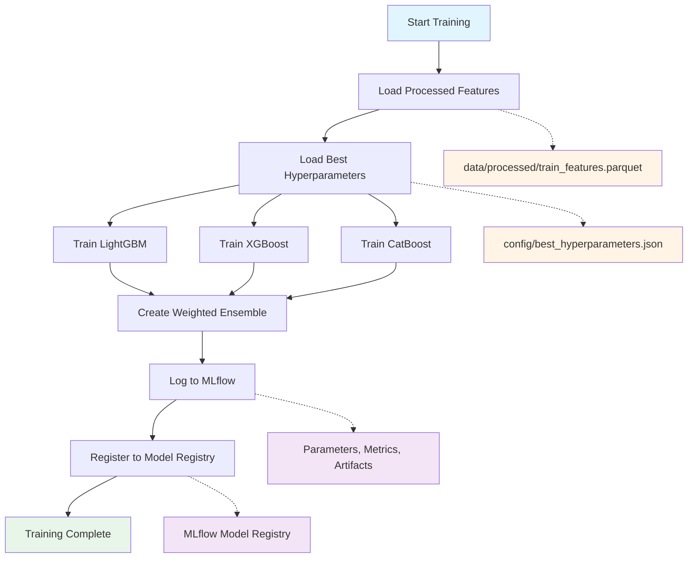

# Model Training

## From Experimentation to Production

Once experimentation identifies the optimal model architecture and hyperparameters, the next step is creating production-ready training code. While Jupyter notebooks are excellent for exploration and iteration, production systems require:

- **Reproducibility**: Consistent results across runs without manual intervention
- **Automation**: Ability to retrain models on schedule or when new data arrives
- **Versioning**: Automatic tracking of model lineage and data dependencies
- **Validation**: Built-in checks to ensure model quality before deployment

The production training pipeline transforms the best practices discovered in notebooks into automated, monitored workflows that can be scheduled, triggered by data updates, or integrated into CI/CD systems.

## Production Training Pipeline

The `src/models/train_ensemble.py` module provides automated training using the best hyperparameters discovered during experimentation:

```bash
python src/models/train_ensemble.py
```

This script loads hyperparameters from `config/best_hyperparameters.json`, trains the ensemble model, and registers it to MLflow Model Registry—all without manual intervention.

## Training Workflow

The production training pipeline follows a structured workflow to ensure reproducibility and traceability:



### Pipeline Steps

**1. Load Processed Features**

Reads the most recently processed features from `data/processed/train_features.parquet`. This parquet file contains all engineered features (calendar, lag, rolling, promotion, competition) ready for model training.

**2. Load Best Hyperparameters**

Loads optimal hyperparameters from `config/best_hyperparameters.json`, which were identified through Optuna optimization in notebook 04. This ensures the production model uses the same configuration that achieved the best validation performance.

**3. Train Individual Models**

Trains three gradient boosting models in parallel using the loaded hyperparameters:

- **LightGBM**: Fast training with excellent performance on tabular data
- **XGBoost**: Robust model with strong regularization capabilities
- **CatBoost**: Specialized handling of categorical features

Each model is trained using 5-fold time-series cross-validation to ensure robust performance estimates.

**4. Create Weighted Ensemble**

Combines the three models using predetermined weights (30% LightGBM, 60% XGBoost, 10% CatBoost) to leverage the strengths of each algorithm. The ensemble is wrapped in a custom MLflow PyFunc for seamless deployment.

**5. Log to MLflow**

Records all training metadata to MLflow:

- **Parameters**: Hyperparameters for each model and ensemble weights
- **Metrics**: Cross-validation RMSPE scores and training duration
- **Artifacts**: Trained model files, conda environment specification
- **Tags**: Data version (DVC hash), training timestamp, model family

**6. Register to Model Registry**

Automatically registers the trained ensemble to MLflow Model Registry with version number and metadata. The model starts in the "None" stage, awaiting validation before promotion to "Staging."

## Running the Pipeline

To train a production model using the best hyperparameters from experimentation:

```bash
# Train ensemble with best hyperparameters
python src/models/train_ensemble.py
```

The script will:

1. Validate that required files exist (`train_features.parquet`, `best_hyperparameters.json`)
1. Train all three models with optimal hyperparameters
1. Create and register the ensemble to MLflow
1. Output the registered model version number

**Expected output:**

```
Loading features from data/processed/train_features.parquet...
Loading hyperparameters from config/best_hyperparameters.json...
Training LightGBM... (1.2 minutes)
Training XGBoost... (2.3 minutes)
Training CatBoost... (1.8 minutes)
Creating ensemble (weights: LightGBM=0.30, XGBoost=0.60, CatBoost=0.10)...
Registering model to MLflow Model Registry...
✓ Model registered as version 7
```

## Next Steps

After training:

1. **Validate**: Run `python src/models/validate_model.py`
1. **Review**: Check MLflow UI for metrics
1. **Promote**: Move to Staging if validation passes
1. **Test**: Run inference with Staging model
