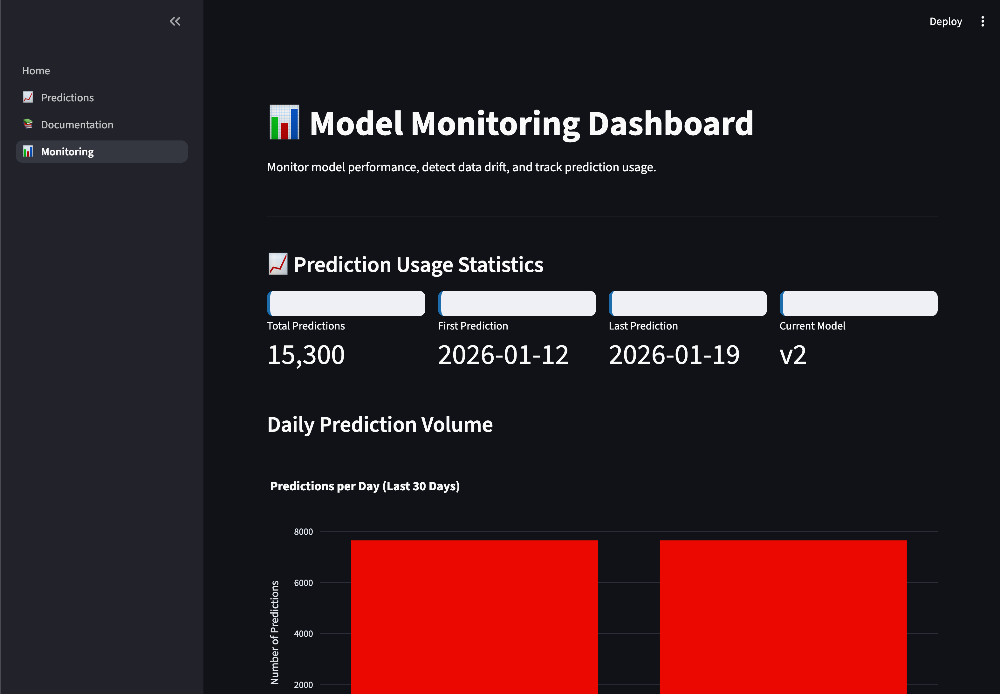
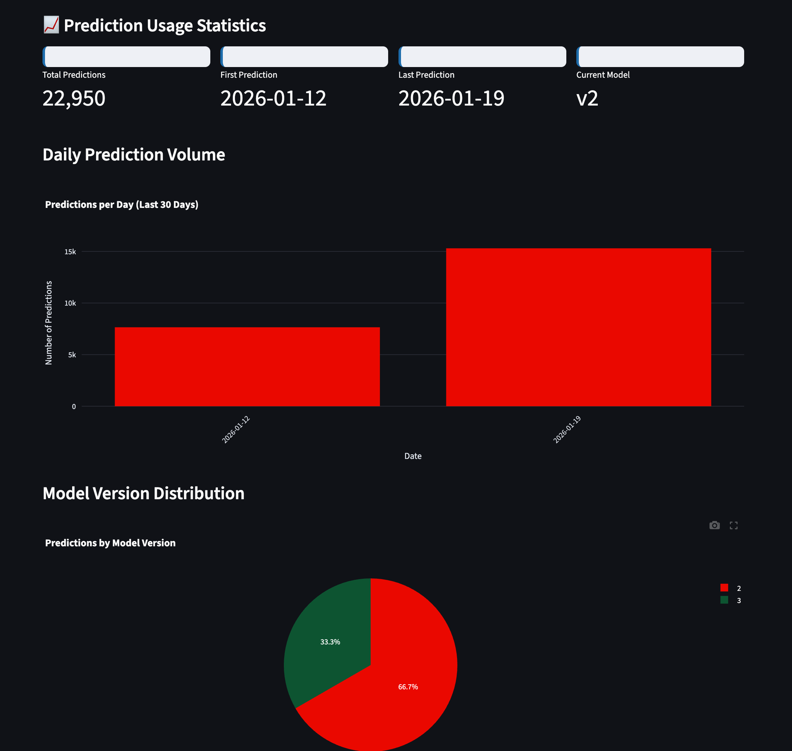
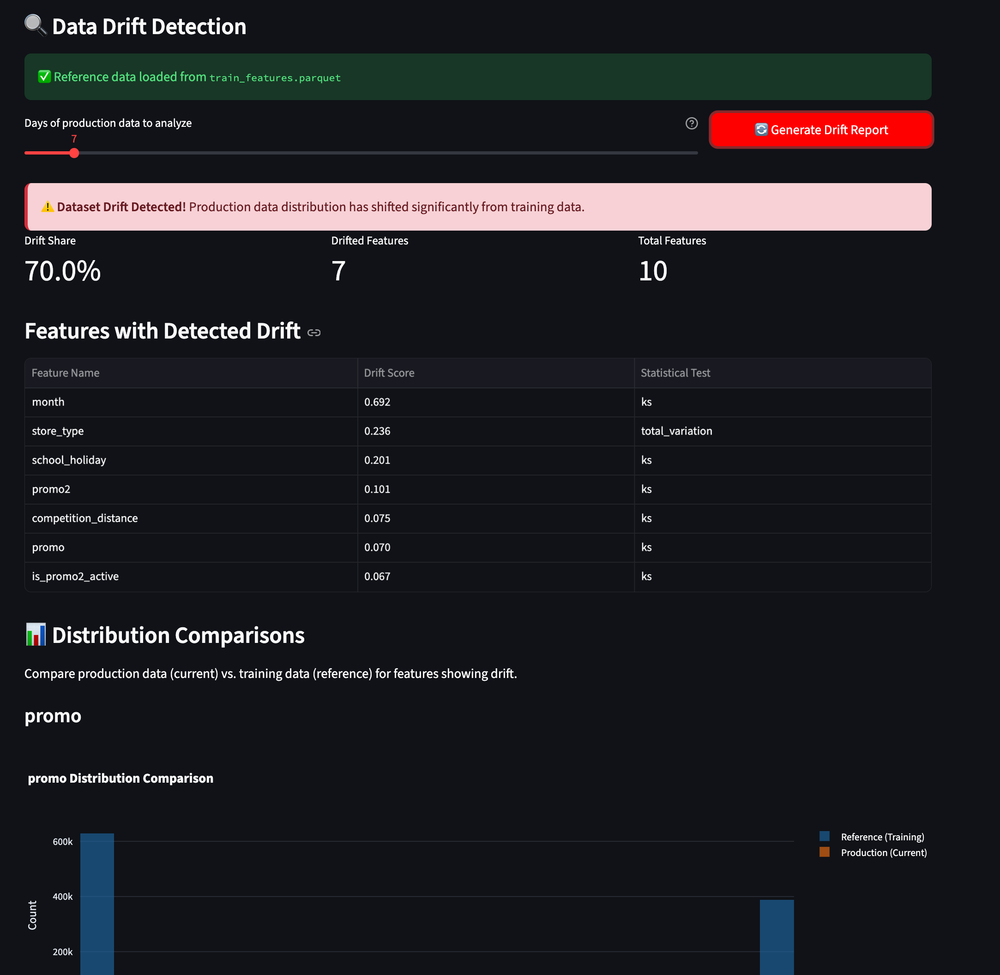

# Monitoring Dashboard Guide

This page provides a guide to using the monitoring dashboard integrated into the Streamlit deployment.

______________________________________________________________________

## How to Launch the Dashboard

The monitoring dashboard is integrated into the main Streamlit application as a separate page. To launch the complete deployment stack including the monitoring dashboard:

```bash
# Launch all services (MLflow, FastAPI, Streamlit)
bash scripts/launch_dashboard.sh
```

Once launched, access the monitoring page at:

- **Main Dashboard**: [http://localhost:8501](http://localhost:8501)
- **Monitoring Page**: Click "📊 Monitoring" in the left sidebar

The monitoring page will display usage statistics and provide tools for drift detection analysis.



______________________________________________________________________

## Generating Monitoring Data

**Important**: In order to see meaningful results on the monitoring dashboard, you need to first make predictions. The system logs prediction data which is then used for drift detection and usage analysis.

**How to generate prediction data**:

1. **Individual predictions**: Navigate to the "📈 Predictions" page in the Streamlit app and make single predictions using the interactive form
1. **Batch predictions**: Upload a CSV file with multiple store/date combinations on the Predictions page for bulk prediction generation

As predictions are made, the system automatically logs:

- Input features (7 raw fields + 46 engineered features)
- Prediction values
- Model version used
- Timestamp metadata

This logged data is then available for monitoring analysis on the dashboard.

______________________________________________________________________

## Dashboard Sections

The monitoring dashboard is organized into two main sections:

### 1. Prediction Usage Statistics

**Purpose**: Track prediction volume and model version distribution



**Metrics displayed**:

- **Total Predictions**: Cumulative count of all predictions made
- **First Prediction**: Date of earliest prediction in database
- **Last Prediction**: Date of most recent prediction
- **Current Model**: Active model version serving predictions

**Visualizations**:

- **Daily Prediction Volume**: Bar chart showing predictions per day (last 30 days)
- **Model Version Distribution**: Pie chart showing prediction count by model version

**Use cases**:

- Monitor API usage trends
- Identify prediction volume spikes or drops
- Track model version adoption after deployments
- Detect anomalies in prediction patterns

______________________________________________________________________

### 2. Data Drift Detection

**Purpose**: Compare production data distributions against training data to detect drift



#### Prerequisites

Before generating drift reports, ensure:

1. **Reference data exists**: Training features at `data/processed/train_features.parquet`
1. **Predictions logged**: At least a few days of production predictions in database
1. **DataOps workflow completed**: Run `bash scripts/dataops_workflow.sh` if needed

#### Generating a Drift Report

**Step 1: Select analysis window**

Use the slider to choose how many days of production data to analyze:

- **Minimum**: 1 day
- **Maximum**: 90 days
- **Recommended**: 7 days (one week)
- **Extended analysis**: 30 days for monthly trends

**Step 2: Generate report**

Click the **"🔄 Generate Drift Report"** button to:

1. Query production predictions from the selected time window
1. Load reference training data
1. Compare distributions using statistical tests
1. Generate drift summary and visualizations

**Step 3: Review results**

The dashboard displays:

- **Overall drift status**: Alert box indicating if dataset drift was detected
- **Drift metrics**:
    - Drift Share: Percentage of features showing drift
    - Drifted Features: Count of features exceeding drift thresholds
    - Total Features: Number of features analyzed (~10)
- **Drifted features table**: Feature name, drift score, statistical test used
- **Distribution comparisons**: Visual charts comparing reference vs. production

______________________________________________________________________

## Related Pages

- [Monitoring Overview](overview.md) - Introduction and architecture
- [Drift Detection](drift-detection.md) - Statistical methodology
- [Deployment Overview](../deployment/overview.md) - System architecture
