# Data Drift Detection

This page explains the technical details of how data drift is detected and measured in the Rossmann forecasting monitoring system.

______________________________________________________________________

## What is Data Drift?

**Data drift** occurs when the statistical properties of production data differ from the training data distribution. In the context of the Rossmann sales forecasting system, drift can manifest in several ways. Seasonal patterns such as holiday shopping seasons or weather changes can cause temporary shifts in customer behavior. Business changes like new promotions, store openings, or market shifts introduce data patterns the model hasn't seen before. Data quality issues including schema changes, missing values, or pipeline failures can also appear as drift, even though they represent problems rather than real-world changes. External factors such as economic conditions or competitor behavior may gradually shift the underlying data distribution.

When drift occurs, model performance can degrade because the model encounters data patterns it wasn't trained on. This makes drift detection a critical component of production ML monitoring.

______________________________________________________________________

## Drift Detection Approach

### Two-Sample Statistical Testing

Our drift detection compares **reference data** (training set) against **current data** (recent production predictions) using statistical hypothesis tests:

```mermaid
flowchart LR
    A[Reference Data<br/>Training Features] --> C[Statistical Test]
    B[Current Data<br/>Production Features] --> C
    C --> D{p-value < 0.05?}
    D -->|Yes| E[🚨 Drift Detected]
    D -->|No| F[✅ No Drift]

    style A fill:#e1f5ff
    style B fill:#fff4e1
    style C fill:#f3e5f5
    style E fill:#ffebee
    style F fill:#e8f5e9
```



**Reference Data**: Full training feature set (`data/processed/train_features.parquet`)

- ~800,000 observations from historical training period
- Represents expected "normal" distribution

**Current Data**: Recent production predictions (configurable window)

- Default: Last 7 days of predictions
- Extracted from predictions database (`data/monitoring/predictions.db`)

______________________________________________________________________

## Statistical Tests by Feature Type

### Numerical Features (Kolmogorov-Smirnov Test)

For continuous features like `competition_distance`, `day_of_week`, `month`:

**Test**: Two-sample Kolmogorov-Smirnov (KS) test

**Null Hypothesis**: Reference and current data come from the same distribution

**Test Statistic**:

$$ D = \\max_x |F_1(x) - F_2(x)| $$

Where $F_1$ and $F_2$ are the empirical cumulative distribution functions.

**Drift Threshold**: `p-value < 0.05` (5% significance level)

**Interpretation**:

- **p-value ≥ 0.05**: No significant drift, distributions are similar
- **p-value \< 0.05**: Drift detected, distributions differ significantly

**Example**:

```python
from scipy import stats

ref_values = reference_df['competition_distance'].dropna()
cur_values = current_df['competition_distance'].dropna()

ks_stat, p_value = stats.ks_2samp(ref_values, cur_values)

if p_value < 0.05:
    print(f"⚠️ Drift detected! KS statistic: {ks_stat:.3f}, p-value: {p_value:.4f}")
else:
    print(f"✅ No drift. KS statistic: {ks_stat:.3f}, p-value: {p_value:.4f}")
```

______________________________________________________________________

### Categorical Features (Total Variation Distance)

For discrete features like `store_type`, `assortment`, `state_holiday`, and `promo`, we use the Total Variation Distance (TVD) metric. This metric quantifies how different two categorical distributions are by summing the absolute differences in category proportions.

**Mathematical Definition**:

The Total Variation Distance is calculated as:

$$ \\text{TVD} = \\frac{1}{2} \\sum\_{i=1}^{k} \\left| p_i - q_i \\right| $$

Where $p_i$ represents the proportion of category $i$ in the reference data, $q_i$ represents the proportion of category $i$ in the current production data, and $k$ is the total number of unique categories across both datasets.

**Drift Threshold**: We flag drift when TVD exceeds 0.2, meaning more than 20% of the distribution has shifted.

**Interpretation**: A TVD of 0.2 or less indicates that the category distributions are similar between reference and production data, suggesting no significant drift. When TVD exceeds 0.2, it signals that the categorical distribution has changed substantially, warranting investigation.

**Example**:

```python
# Get category proportions
ref_counts = reference_df['promo'].value_counts(normalize=True)
cur_counts = current_df['promo'].value_counts(normalize=True)

# Align categories
all_categories = sorted(set(ref_counts.index) | set(cur_counts.index))

# Calculate total variation distance
tvd = 0.0
for cat in all_categories:
    ref_prop = ref_counts.get(cat, 0)
    cur_prop = cur_counts.get(cat, 0)
    tvd += abs(ref_prop - cur_prop)

if tvd > 0.2:
    print(f"⚠️ Drift detected! TVD: {tvd:.3f}")
else:
    print(f"✅ No drift. TVD: {tvd:.3f}")
```

**Why Total Variation Distance?**

We chose Total Variation Distance over other categorical tests like chi-square for several practical reasons. First, it's simple and interpretable, ranging from 0 (identical distributions) to 2 (completely different distributions). Second, it's robust to small sample sizes and unbalanced categories, which are common in production environments where you might be comparing a week of predictions against years of training data. Third, unlike the chi-square test, TVD makes no distributional assumptions, avoiding the frequency mismatch errors we encountered during development. Finally, the 0.2 threshold has a clear interpretation: it represents a meaningful shift where 20% of the distribution has changed position.

______________________________________________________________________

## Features Monitored

The system tracks **~10 key features** most important for model performance:

| Feature                | Type        | Statistical Test | Description                         |
| ---------------------- | ----------- | ---------------- | ----------------------------------- |
| `promo`                | Categorical | Total Variation  | Daily promotion active (0/1)        |
| `day_of_week`          | Numerical   | KS Test          | Day of week (1-7)                   |
| `month`                | Numerical   | KS Test          | Month of year (1-12)                |
| `state_holiday`        | Categorical | Total Variation  | State holiday type (0, a, b, c)     |
| `school_holiday`       | Categorical | Total Variation  | School holiday indicator (0/1)      |
| `store_type`           | Categorical | Total Variation  | Store format (a, b, c, d)           |
| `assortment`           | Categorical | Total Variation  | Product assortment (a, b, c)        |
| `competition_distance` | Numerical   | KS Test          | Distance to competitor (meters)     |
| `promo2`               | Categorical | Total Variation  | Long-term promo participation (0/1) |
| `is_promo2_active`     | Categorical | Total Variation  | Promo2 currently active (0/1)       |

**Why only ~10 features?**

Rather than monitoring all 46 engineered features, we focus on approximately 10 key features selected based on model feature importance analysis. This focused approach offers several advantages. First, drift detection runs in seconds rather than minutes, enabling faster feedback loops. Second, it's much easier to interpret which features are driving drift when you're looking at 10 features rather than 46. Third, the selected features provide good coverage across different types: temporal features like month and day of week, promotional features like promo and promo2, and store characteristics like store type and competition distance. This strategic subset captures the most important signals while maintaining system performance and interpretability.

______________________________________________________________________

## Overall Drift Detection

**Dataset-level drift** is flagged when more than 50% of monitored features show drift:

$$ \\text{Drift Share} = \\frac{\\text{Number of Drifted Features}}{\\text{Total Features Checked}} $$

$$ \\text{Dataset Drift} = \\begin{cases} \\text{True} & \\text{if Drift Share} > 0.5 \\ \\text{False} & \\text{otherwise} \\end{cases} $$

**Example**:

- Total features checked: 10
- Features with drift: 6
- Drift share: 6/10 = 0.60 (60%)
- **Result**: Dataset drift detected ⚠️

This conservative threshold ensures we only alert when drift is substantial and widespread.

______________________________________________________________________

## Drift Report Output

The drift detection system generates a JSON summary with:

```json
{
  "dataset_drift_detected": true,
  "drift_share": 0.60,
  "number_of_drifted_features": 6,
  "total_features_checked": 10,
  "drifted_features": [
    {
      "feature": "promo",
      "drift_score": 0.452,
      "stattest": "total_variation"
    },
    {
      "feature": "month",
      "drift_score": 0.234,
      "stattest": "ks"
    }
  ]
}
```

**Fields**:

- `dataset_drift_detected`: Overall drift flag (boolean)
- `drift_share`: Proportion of features showing drift (0.0-1.0)
- `number_of_drifted_features`: Count of drifted features
- `total_features_checked`: Total features analyzed
- `drifted_features`: List of features with detected drift
    - `feature`: Feature name
    - `drift_score`: Test statistic (TVD or KS statistic)
    - `stattest`: Statistical test used (`total_variation` or `ks`)

______________________________________________________________________

## Limitations and Caveats

### What Drift Detection Does

Our drift detection system provides several key capabilities. It identifies distribution shifts in feature values by comparing production data against the reference training set. It quantifies the magnitude of drift using well-established statistical tests (KS test for numerical features, TVD for categorical features). The system alerts when drift exceeds predefined thresholds, enabling proactive monitoring. Finally, it tracks drift over time through historical JSON reports, allowing you to analyze trends and patterns.

### What Drift Detection Does NOT Do

It's important to understand the current limitations of the system. First, drift detection flags when distributions have changed but does not explain why the drift occurred—that requires domain knowledge and investigation. Second, it cannot predict the impact of drift on model performance without actual sales labels to measure prediction error. Third, it cannot detect concept drift (changes in the relationship between features and target) without ground truth labels. Fourth, the system may flag expected seasonal patterns as drift since it doesn't have built-in seasonality awareness. Finally, it tests features independently rather than detecting multivariate drift or changes in feature interactions.

### Important Considerations

When interpreting drift detection results, several practical factors should be considered. **Seasonal patterns can appear as drift**: For example, a spike in the `school_holiday` feature during December is expected behavior, not concerning drift. Analysts must use domain knowledge to distinguish between expected seasonal patterns and genuinely concerning shifts in the data.

**Sample size affects reliability**: Small production samples may trigger false positives in statistical tests. We recommend analyzing at least 7 days of predictions (typically hundreds or thousands of observations) for reliable drift detection. Very small samples can show apparent drift simply due to random variation.

**Thresholds may need tuning**: The current thresholds (p-value \< 0.05 for KS test, TVD > 0.2 for categorical features) are reasonable starting points but may need adjustment based on your specific business context. If you're seeing too many false positives (drift alerts for normal variation), consider tightening the thresholds. Conversely, if you're missing important drift events, the thresholds may be too loose.

**Limited feature coverage**: The system only monitors 10 key features out of the 46 total engineered features. While these capture the most important signals, drift in unmonitored features won't be detected. Consider periodically reviewing whether the selected features still represent the most important model inputs.

______________________________________________________________________

## References

**Statistical Methods**:

- [Kolmogorov-Smirnov Test](https://en.wikipedia.org/wiki/Kolmogorov%E2%80%93Smirnov_test)
- [Total Variation Distance](https://en.wikipedia.org/wiki/Total_variation_distance_of_probability_measures)

**Data Drift Monitoring**:

- [Evidently AI Documentation](https://docs.evidentlyai.com/)
- [Google Cloud - Detecting Training-Serving Skew](https://cloud.google.com/architecture/mlops-continuous-delivery-and-automation-pipelines-in-machine-learning#detecting_training-serving_skew)
- [AWS SageMaker Model Monitor](https://docs.aws.amazon.com/sagemaker/latest/dg/model-monitor-data-quality.html)

**MLOps Best Practices**:

- [Chip Huyen - Monitoring ML Systems](https://huyenchip.com/2022/02/07/data-distribution-shifts-and-monitoring.html)
- [Made With ML - Monitoring](https://madewithml.com/courses/mlops/monitoring/)
