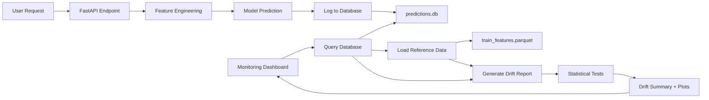

# Model Monitoring Overview

## Introduction

Model monitoring is a critical component of production ML systems that ensures models continue to perform well after deployment. Once a model is serving predictions in production, its performance can degrade over time due to changes in the underlying data distribution, business environment, or data quality issues.

This project implements a **prediction logging and drift detection system** to monitor the Rossmann sales forecasting model in production. The monitoring infrastructure captures prediction metadata, tracks feature distributions, and alerts when data drift is detected.

## Why Monitor ML Models?

Machine learning models are trained on historical data, but production environments are dynamic:

- **Data drift**: Feature distributions change over time (e.g., seasonal patterns, new promotions)
- **Concept drift**: The relationship between features and target changes (e.g., customer behavior shifts)
- **Data quality issues**: Missing values, schema changes, or data pipeline failures
- **Business changes**: New stores, products, or market conditions not seen during training

Without monitoring, these issues can silently degrade model performance, leading to poor business decisions.

## Monitoring Components

Our monitoring system consists of three key components:

### 1. Prediction Logging

Every prediction made by the deployed model is logged to a SQLite database with:

- **Metadata**: Timestamp, batch ID, model version, model stage
- **Raw inputs**: Store, date, day of week, open, promo, holidays
- **Key engineered features**: Month, year, store type, assortment, competition distance, promo2 status
- **Prediction**: The forecasted sales value
- **Performance metrics**: API response time

**Database location**: `data/monitoring/predictions.db`

**Key features tracked** (~10 most important):

- `promo`: Daily promotion active (0/1)
- `day_of_week`: Day of week (1-7)
- `month`: Month of year (1-12)
- `state_holiday`: State holiday type (0, a, b, c)
- `school_holiday`: School holiday indicator (0/1)
- `store_type`: Store format (a, b, c, d)
- `assortment`: Product assortment level (a, b, c)
- `competition_distance`: Distance to nearest competitor
- `promo2`: Long-running promo participation (0/1)
- `is_promo2_active`: Whether Promo2 is currently active (0/1)

### 2. Data Drift Detection

The drift detection system compares production data distributions against training data using:

- **Statistical tests**: Kolmogorov-Smirnov for numerical features, total variation distance for categorical features
- **Reference data**: Full training feature set (`data/processed/train_features.parquet`)
- **Detection window**: Configurable (default: 7 days of production data)
- **Alerting**: Visual dashboard warnings when drift exceeds thresholds

**See**: [Data Drift Detection](drift-detection.md) for detailed methodology

### 3. Monitoring Dashboard

An interactive Streamlit dashboard provides:

- **Usage statistics**: Total predictions, daily volume, model version distribution
- **Drift reports**: Feature-level drift scores, distribution comparisons, trend analysis
- **Visualizations**: Time-series charts, histograms, comparison plots
- **Recommendations**: When to retrain, best practices, next steps

**Access**: Integrated into main Streamlit deployment at `http://localhost:8501` → Monitoring page

## Monitoring Workflow

**Flow**:

1. User makes prediction request via API or Streamlit
1. FastAPI processes request and generates prediction
1. Prediction logger captures inputs, features, and prediction
1. Data stored in SQLite database with timestamp
1. Monitoring dashboard queries recent predictions
1. Drift detector compares production vs. training distributions
1. Statistical tests identify drifted features
1. Dashboard displays drift summary and visualizations

## Design Decisions

### Why SQLite?

- **Simplicity**: File-based, no server setup required
- **Portability**: Easy to backup, version, and share
- **Sufficient scale**: Handles millions of predictions efficiently
- **Production note**: Replace with PostgreSQL/MySQL for high-throughput production systems

### Why ~10 Key Features?

- **Focus**: Monitor most important features rather than all 46
- **Performance**: Faster drift detection on subset
- **Interpretability**: Easier to understand what's driving drift
- **Coverage**: Selected features represent different types (temporal, promotional, store characteristics)

### Why Full Training Data as Reference?

- **Accuracy**: Most complete representation of expected distribution
- **Consistency**: Avoids sampling bias from using subset
- **Trade-off**: Larger file size (~200MB parquet) vs. 10MB sample
- **Note**: Can switch to sampled reference if performance is an issue

## Monitoring Best Practices

### When to Check for Drift

- **Weekly**: Run drift detection on past 7 days vs. training data
- **After events**: Check after major promotions, holidays, or business changes
- **Before retraining**: Understand what has changed since last training
- **Continuous**: Consider automated daily/weekly drift monitoring jobs

### When to Retrain

Consider retraining if you observe:

- **Significant drift**: >20% of key features showing drift
- **Target drift**: Prediction distribution has shifted substantially
- **Business changes**: New stores, products, or market conditions
- **Regular schedule**: Monthly or quarterly retraining even without drift
- **Performance degradation**: Actual sales vs. predictions show increasing errors

### What to Do When Drift is Detected

1. **Investigate**: Review drift report to identify which features are drifting
1. **Validate**: Check if drift is expected (seasonal patterns) or concerning (data quality)
1. **Assess impact**: Does drift affect prediction quality? Check actual vs. predicted performance
1. **Root cause analysis**: Understand why drift occurred (business change, data pipeline issue, etc.)
1. **Decide action**:
    - **Retrain** if drift is substantial and affecting performance
    - **Monitor** if drift is minor or expected seasonal variation
    - **Fix data** if drift is due to data quality issues

## Current Limitations

### What This Monitoring System Does

- ✅ Logs all predictions with key features
- ✅ Detects distribution changes in features (data drift)
- ✅ Provides visual comparison of reference vs. production distributions
- ✅ Alerts when drift thresholds are exceeded
- ✅ Tracks prediction volume and model version usage

### What This Monitoring System Does NOT Do

- ❌ **Performance monitoring**: Does not track prediction accuracy (requires ground truth labels)
- ❌ **Root cause analysis**: Flags drift but doesn't explain why it occurred
- ❌ **Automated retraining**: Does not automatically trigger model retraining
- ❌ **Target drift detection**: Cannot detect concept drift without actual sales data
- ❌ **Advanced drift analysis**: No temporal drift trends, multivariate drift, or sensitivity analysis

### Scope and Production Considerations

This implementation provides a **lightweight monitoring foundation** focused on the essentials: prediction logging, data drift detection, and basic visualization. It's suitable for demonstration purposes and small-scale deployments where monitoring is integrated directly into the Streamlit app for simplicity. However, a comprehensive production system would extend this foundation with additional capabilities including performance tracking with ground truth labels, temporal drift trend analysis, multivariate drift detection, automated retraining workflows, scheduled monitoring jobs, alerting integration (Slack, email), time-series databases (InfluxDB, Prometheus), real-time dashboards (Grafana), and deployment as a separate monitoring service decoupled from the prediction API. This separation is particularly important in production environments as it provides better security (monitoring internals not exposed to customers), performance (monitoring queries don't impact prediction latency), scalability (independent scaling), and maintenance flexibility (updates without redeploying prediction services).

## Next Steps

1. **Review**: [Data Drift Detection](drift-detection.md) for statistical methodology
1. **Explore**: [Dashboard Guide](dashboard.md) for using the monitoring interface
1. **Implement**: Performance tracking when ground truth labels become available
1. **Plan**: Production monitoring architecture based on team needs

## References

- [Evidently AI Documentation](https://docs.evidentlyai.com/)
- [Google ML Best Practices - Monitoring](https://cloud.google.com/architecture/mlops-continuous-delivery-and-automation-pipelines-in-machine-learning#mlops_level_2_cicd_pipeline_automation)
- [AWS SageMaker Model Monitor](https://docs.aws.amazon.com/sagemaker/latest/dg/model-monitor.html)
- [Chip Huyen - ML Systems Design (Monitoring Chapter)](https://github.com/chiphuyen/machine-learning-systems-design)
